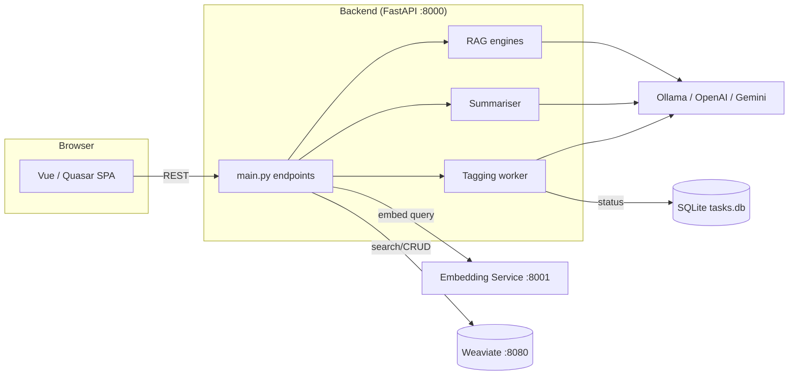

# semANT — Demo Application

**Quezio** (working name: semANT demo) is a web application for semantic exploration of digitised Czech cultural-heritage texts. It combines full-text, vector and hybrid search over a Weaviate database with LLM-powered summarisation, Retrieval-Augmented Generation (RAG), and AI-assisted text tagging.

> **Project ID:** DH23P03OVV060 (NAKI III programme)
> **Consortium:** Brno University of Technology · Moravian Library · Masaryk University

## Key Features

| Feature | Description |
|---|---|
| **Hybrid search** | BM25 + vector (HNSW) with configurable alpha; metadata & tag filters |
| **Summarisation** | Per-result titles, per-result summaries and overall query summary via configurable LLM |
| **RAG chat** | Multi-turn question answering with source citations; simple & adaptive (LangGraph) pipelines |
| **Tagging** | Manual & LLM-assisted tag propagation across document collections |
| **User collections** | Group chunks into named collections per user |

## Technology Stack

| Layer | Technology |
|---|---|
| Database | Weaviate 1.30 (Docker) + SQLite (async, task tracking) |
| Embeddings | `BAAI/bge-multilingual-gemma2` via dedicated FastAPI service |
| Backend | Python 3.12 · FastAPI · LangChain / LangGraph · Ollama / OpenAI / Google Gemini |
| Frontend | Vue 3 · Quasar 2 · TypeScript · Pinia · Axios |

## Repository Structure

```
semant-demo/
├── docs/                          # project documentation (see below)
├── embedding_service/             # Gemma embedding microservice (FastAPI, port 8001)
├── semant_demo_backend/           # main API server (FastAPI, port 8000)
│   ├── semant_demo/
│   │   ├── main.py                # FastAPI app, startup, core endpoints
│   │   ├── config.py              # env-based configuration (Config singleton)
│   │   ├── schemas.py             # Pydantic models + SQLAlchemy Task model
│   │   ├── weaviate_search.py     # Weaviate client: search, tag CRUD, collections
│   │   ├── gemma_embedding.py     # HTTP client to embedding_service
│   │   ├── ollama_proxy.py        # round-robin Ollama client
│   │   ├── configs/               # YAML configs (summariser prompts)
│   │   ├── llm_api/               # async LLM abstraction (OpenAI, Ollama)
│   │   ├── rag/                   # RAG implementations + YAML configs
│   │   ├── routes/                # FastAPI routers (rag, tags, collections)
│   │   ├── summarization/         # search-result summariser (Jinja2 templates)
│   │   ├── tagging/               # LLM-based tag propagation logic
│   │   └── utils/                 # Jinja2 template helpers
│   └── tests/                     # unit tests (llm_api, summarization, utils)
├── semant_demo_frontend/          # Vue/Quasar SPA
│   └── src/
│       ├── pages/                 # SearchPage, RagPage, TagManagementPage, …
│       ├── stores/                # Pinia stores (user, collections)
│       ├── models.ts              # TypeScript interfaces mirroring backend schemas
│       └── boot/axios.ts          # Axios instance & base URL config
└── weaviate_utils/                # DB bootstrap & inspection scripts
    ├── docker-compose.yml         # Weaviate container definition
    ├── db_insert_jsonl.py         # bulk-insert documents + chunks from JSONL
    ├── inspect_chunks.py          # CLI to dump chunks
    └── inspect_documents.py       # CLI to dump documents
```

## Architecture Overview



## Quick Start

```bash
# 1. Start Weaviate
cd weaviate_utils && docker compose up -d

# 2. Start the embedding service (needs GPU recommended)
cd embedding_service
pip install -r requirements.txt
python run.py                       # listens on :8001

# 3. Load data into Weaviate
cd weaviate_utils
pip install -r requirements.txt
python db_insert_jsonl.py --source-dir /path/to/jsonl_data --delete-old

# 4. Start the backend
cd semant_demo_backend
pip install -r requirements.txt
python run.py                       # listens on :8000

# 5. Start the frontend (dev mode)
cd semant_demo_frontend
npm install
npx quasar dev                      # listens on :9000
```

### Environment Variables (Backend)

| Variable | Default | Description |
|---|---|---|
| `WEAVIATE_HOST` | `localhost` | Weaviate hostname |
| `WEAVIATE_REST_PORT` | `8080` | Weaviate HTTP port |
| `WEAVIATE_GRPC_PORT` | `50051` | Weaviate gRPC port |
| `OLLAMA_URLS` | `http://localhost:11434` | Comma-separated Ollama endpoints |
| `OLLAMA_MODEL` | `gemma3:12b` | Default Ollama model |
| `OPENAI_API_KEY` | _(empty)_ | OpenAI key (for OpenAI-based RAG configs) |
| `GOOGLE_API_KEY` | _(empty)_ | Google Gemini key |
| `ALLOWED_ORIGIN` | `http://localhost:9000` | CORS origin for frontend |
| `PORT` | `8000` | Backend listen port |
| `STATIC_PATH` | `./static` | Path to built frontend assets (production) |
| `RAG_CONFIGS_PATH` | `rag/rag_configs/configs` | Directory with RAG YAML configs |
| `SEARCH_SUMMARIZER_CONFIG` | `configs/search_summarizer.yaml` | Summariser config path |
| `GOOGLE_MODEL` | `gemini-2.5-pro` | Default Google model |
| `OPENAI_MODEL` | `gpt-4o-mini` | Default OpenAI model |
| `MODEL_TEMPERATURE` | `0.0` | Default LLM temperature |
| `LANGCHAIN_API_KEY` | _(empty)_ | LangChain/LangSmith tracing key |

> **Note:** `GEMMA_URL` (embedding service URL) is currently hardcoded to `http://localhost:8001` in `config.py` and is not configurable via environment variable.

## API Endpoints

| Method | Path | Description |
|---|---|---|
| `POST` | `/api/search` | Hybrid/text/vector search with filters |
| `POST` | `/api/summarize/{type}` | Summarise search results (`results`) |
| `POST` | `/api/question/{text}` | Q&A over search results (OpenAI) |
| `GET`  | `/api/rag/configurations` | List available RAG configs |
| `POST` | `/api/rag` | RAG chat request |
| `POST` | `/api/rag/explain` | Explain selected text in RAG context |
| `POST` | `/api/tag` | Create a tag |
| `POST` | `/api/tagging_task` | Start async LLM tagging job |
| `GET`  | `/api/tag_status/{id}` | Poll tagging task status |
| `GET`  | `/api/all_tasks` | List all tagging tasks |
| `DELETE` | `/api/tagging_task/{id}` | Cancel a running tagging task |
| `GET`  | `/api/all_tags` | List all tags |
| `DELETE` | `/api/whole_tags` | Delete tags entirely |
| `DELETE` | `/api/automatic_tags` | Remove automatic tag assignments |
| `PUT` | `/api/tag_approval` | Approve or reject an automatic tag |
| `POST` | `/api/filter_tags` | Filter chunks by tag UUIDs |
| `POST` | `/api/tagged_texts` | Get chunks tagged with specific tags |
| `POST` | `/api/user_collection` | Create user collection |
| `GET`  | `/api/collections` | List collections for a user |
| `POST` | `/api/chunk_2_collection` | Add chunk to collection |
| `GET`  | `/api/chunks_of_collection` | List chunks in a collection |

## Testing

```bash
cd semant_demo_backend
python -m pytest tests/ -v
```

Tests cover the LLM API abstraction, Jinja2 template rendering and the summarisation pipeline. RAG factory loading is validated via test YAML configs under `rag/rag_configs/tests/`.

## Further Documentation

| Document | Description |
|---|---|
| [docs/VISION.md](docs/VISION.md) | Project vision, goals and user personas |
| [docs/ARCHITECTURE.md](docs/ARCHITECTURE.md) | Detailed architecture, RAG pipelines, data flow |
| [docs/DATABASE.md](docs/DATABASE.md) | Weaviate schema and SQLite task model |
| [docs/DEPLOYMENT.md](docs/DEPLOYMENT.md) | Production deployment and configuration guide |
| [docs/TODO.md](docs/TODO.md) | Recommended improvements and known technical debt |

## Contribution Guidelines

1. Create an issue **and** a branch with the same name.
2. Issue should contain: descriptive title, short summary, technical checklist, verification steps.
3. Work on your branch; write notes/questions as issue comments.
4. Write or update unit tests.
5. Update relevant documentation; add/update diagrams where appropriate.
6. Merge `main` into your branch, resolve conflicts.
7. Open a pull request, assign a reviewer.
8. After approval, merge/rebase and delete the branch.
