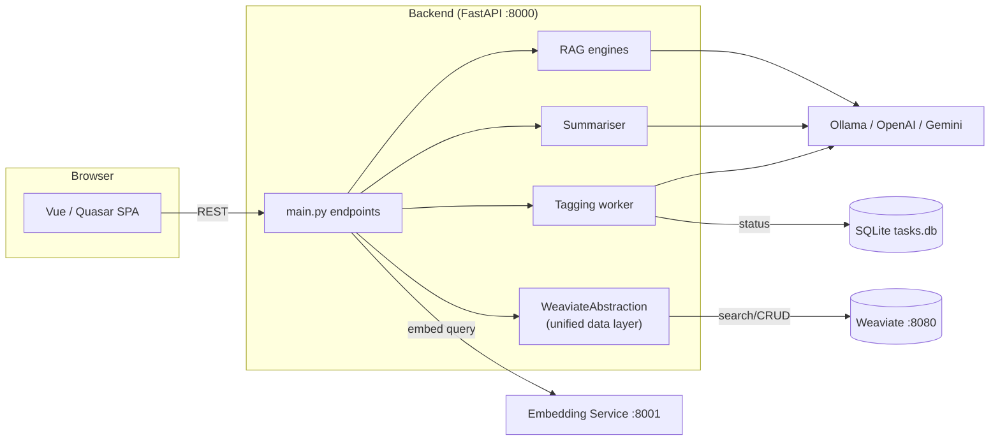

# semANT — Demo Application

**Quezio** (working name: semANT demo) is a web application for semantic exploration of digitised Czech cultural-heritage texts. It combines full-text, vector and hybrid search over a Weaviate database with LLM-powered summarisation, Retrieval-Augmented Generation (RAG), and AI-assisted text tagging.

> **Project ID:** DH23P03OVV060 (NAKI III programme)
> **Consortium:** Brno University of Technology · Moravian Library · Masaryk University

## Key Features

| Feature | Description |
|---|---|
| **Hybrid search** | BM25 + vector (HNSW) with configurable alpha; metadata & tag filters |
| **Summarisation** | Per-result titles, per-result summaries and overall query summary via configurable LLM |
| **RAG chat** | Multi-turn question answering with source citations; pipeline variants: `rag_generator`, `adaptive_rag`, `adaptive_rag_og`, `incremental_rag`, `agentic_rag` (recommended: `incremental_rag`) |
| **Tagging** | Manual & LLM-assisted tag propagation across user collections |
| **Tag spans** | Character-level annotations of tags inside chunks (manual `pos`/`neg` and AI-suggested `auto` spans, the latter carrying `reason` + `confidence`) |
| **AI span suggestions** | Two NDJSON-streaming endpoints (thorough / optimised) backed by the external Topicer service |
| **Span discussion chat** | Streaming assistant chat around a single span using its tag, document metadata and surrounding chunk text |
| **User collections** | Group documents (and their chunks) into named collections per user |
| **App feedback** | In-app feedback form persisted server-side as JSONL |

## Technology Stack

| Layer | Technology |
|---|---|
| Database | Weaviate 1.30 (Docker) + SQLite (async, task tracking) |
| Embeddings | `BAAI/bge-multilingual-gemma2` via dedicated FastAPI service |
| Backend | Python 3.12 · FastAPI · LangChain / LangGraph · Ollama / OpenAI / Google Gemini |
| Frontend | Vue 3 · Quasar 2 · TypeScript · Pinia · Axios |

## Repository Structure

```
semant-demo/
├── docs/                          # project documentation (see below)
├── deploy/                        # Docker Compose stack management
│   ├── docker-compose.app.yaml    # Production app stack (backend + frontend)
│   ├── docker-compose.app-test.yml  # Test app stack (CI preview environments)
│   ├── docker-compose.database.yml  # Weaviate database (production)
│   ├── docker-compose.database-test.yml  # Weaviate database (test)
│   ├── docker-compose.embedder.yml  # GPU embedding service
│   ├── Dockerfile                 # Multi-stage build for backend + frontend
│   ├── Dockerfile.embedder        # Build for the embedding service
│   ├── update.sh                  # Helper script to run docker compose with .env
│   ├── .env.example               # Environment variables template (production)
│   ├── .env.test.example          # Environment variables template (test/CI)
│   └── README.md                  # Deployment instructions
├── embedding_service/             # Gemma embedding microservice (FastAPI, port 8001)
├── semant_demo_backend/           # main API server (FastAPI, port 8000)
│   ├── semant_demo/
│   │   ├── main.py                # FastAPI app, startup, core endpoints
│   │   ├── config.py              # env-based configuration (Config singleton)
│   │   ├── schemas.py             # legacy Pydantic models + SQLAlchemy Task model
│   │   ├── schema/                # focused per-domain Pydantic schemas
│   │   │   ├── ai_assistance.py   # span suggestion + span discussion chat schemas
│   │   │   ├── spans.py           # PostSpan, PatchSpan, BulkUpdateSpansRequest, …
│   │   │   ├── tags.py            # Tag CRUD + bulk schemas
│   │   │   ├── chunks.py          # Chunk-related request/response schemas
│   │   │   ├── documents.py       # Document schemas
│   │   │   └── collections.py     # User-collection schemas
│   │   ├── gemma_embedding.py     # HTTP client to embedding_service
│   │   ├── ollama_proxy.py        # round-robin Ollama client
│   │   ├── ai_assistance/         # external AI integrations
│   │   │   ├── topicer_client.py  # async HTTP client for the Topicer span-proposal service
│   │   │   └── span_chat.py       # streaming "discuss this span" chat
│   │   ├── configs/               # YAML configs (summariser prompts)
│   │   ├── llm_api/               # async LLM abstraction (OpenAI, Ollama, Gemini)
│   │   ├── rag/                   # RAG implementations + YAML configs
│   │   ├── routes/                # FastAPI routers (search, rag, tags, spans,
│   │   │                          # ai_assistance, span_chat, collections,
│   │   │                          # documents, users, feedback)
│   │   ├── summarization/         # search-result summariser (Jinja2 templates)
│   │   ├── tagging/               # LLM-based tag propagation logic
│   │   ├── users/                 # FastAPI Users (auth model, manager, JWT)
│   │   ├── weaviate_utils/        # Weaviate abstraction layer (CRUD per collection)
│   │   │   ├── weaviate_abstraction.py  # Main facade exposing every collection handler
│   │   │   ├── document.py        # Document collection operations
│   │   │   ├── text_chunk.py      # TextChunk collection operations
│   │   │   ├── tag.py             # Tag collection operations
│   │   │   ├── span.py            # Span collection (manual + auto spans, AI metadata)
│   │   │   ├── user_collection.py # UserCollection (user-defined grouping) operations
│   │   │   └── helpers.py         # Shared utility functions
│   │   └── utils/                 # Jinja2 template helpers
│   └── tests/                     # unit tests (auth, llm_api, summarization, utils)
├── semant_demo_frontend/          # Vue/Quasar SPA
│   └── src/
│       ├── pages/                 # SearchPage, RagPage, TagManagementPage,
│       │                          # FeedbackPage, AboutPage, OldUserCollectionsPage,
│       │                          # Collections/* (UserCollectionsPage,
│       │                          #   CollectionOverviewPage, CollectionDocumentsPage,
│       │                          #   CollectionTagsPage, CollectionTaggingJobsPage,
│       │                          #   CollectionMembersPage, DocumentDetailPageV2,
│       │                          #   DocumentTaggingPage/)
│       ├── stores/                # Pinia stores (user-store, collectionsStore,
│       │                          # collectionStatsStore, chunksStore,
│       │                          # chunk_collection-store, documentsStore,
│       │                          # tagsStore, tagSpansStore)
│       ├── composables/           # reusable hooks (useSpanDiscussion, useTags, …)
│       ├── repositories/          # thin wrappers over the generated API client
│       ├── generated/             # OpenAPI-generated TS client (do not edit by hand)
│       ├── models.ts              # TypeScript interfaces mirroring backend schemas
│       └── boot/axios.ts          # Axios instance & base URL config
└── weaviate_utils/                # DB bootstrap & inspection scripts
    ├── docker-compose.yml         # Weaviate container definition
    ├── build_db/                  # standalone schema + data bootstrap helpers
    ├── db_insert_jsonl.py         # bulk-insert documents + chunks from JSONL
    ├── inspect_*.py               # CLI tools to dump chunks, documents, etc.
    ├── delete_*.py                # CLI tools for cleaning collections
    └── migrate.py                 # schema-migration helpers
```

## Architecture Overview



### Weaviate Abstraction Layer

The **WeaviateAbstraction** class provides a unified, object-oriented interface to Weaviate collections. Instead of direct client calls scattered across the codebase, all database operations flow through organized collection handlers:

- **Document**: document metadata and retrieval
- **TextChunk**: text passages with embeddings, metadata and search
- **Tag**: tagging definitions, CRUD, and search
- **Span**: tag span markers within chunks
- **UserCollection**: user-defined groupings of chunks (collections per user)
- **helpers**: shared utility functions (tag reference management, filtering, transforms) used across handlers

Each handler encapsulates:
- **Query construction** (filters, references, properties)
- **Error handling** (custom Weaviate exceptions)
- **Schema consistency** (CRUD operations always respect the schema)
- **Async/await patterns** (non-blocking database I/O)

**Collection names** are centrally managed via the `CollectionNames` schema (Pydantic model) and initialized from `config.py`, allowing handlers to reference collections by name without hardcoding. This makes collection names easily configurable across the application:
```python
# In schemas.py: CollectionNames defines the structure
class CollectionNames(BaseModel):
    chunks_collection_name: str
    tag_collection_name: str
    user_collection_name: str
    document_collection_name: str
    span_collection_name: str
    user_collection_link_name: str
    tag_to_user_collection_link_name: str

# In config.py: CollectionNames values are initialized
self.collectionNames = CollectionNames(
    chunks_collection_name = "Chunks",
    tag_collection_name = "Tag",
    user_collection_name = "UserCollection",
    document_collection_name = "Documents",
    span_collection_name = "Span",
    user_collection_link_name = "userCollection",
    tag_to_user_collection_link_name = "tagToUserCollection",
)

# In handlers: Access collection names consistently
collection = self.client.collections.get(self.collectionNames.chunks_collection_name)
```

**Usage example:**
```python
searcher = WeaviateAbstraction(client, collectionNames)  # initialized at startup

# Create a tag
tag = await searcher.tag.create(collection_id, tagData)

# Search chunks
results = await searcher.textChunk.search(query, limit=10, filters=...)

# Manage user collections
collections = await searcher.userCollection.read(userId)
await searcher.userCollection.add_chunks(chunk_id, collection_id)
```

## Quick Start

### Starting the Stack

```bash
cd deploy
./update.sh up -d --build
```
**Note:** Requires `.env` file configured in `deploy/` directory. 

### Stopping the Stack

```bash
cd deploy
./update.sh down
```

For detailed setup instructions, advanced options, and data management, see [deploy/README.md](deploy/README.md).

### Environment Variables

| Variable | Default | Description |
|---|---|---|
| **Build arguments** | | |
| `REPO` | `https://github.com/DCGM/semant-demo.git` | Git repository to clone |
| `BRANCH` | `main` | Branch to build from |
| `BACKEND_URL` | `https://demo.semant.cz` | Public backend URL baked into the frontend bundle at build time |
| `DOMAIN` | `demo.semant.cz` | Domain name for the Traefik Host rule |
| **Weaviate** | | |
| `WEAVIATE_HOST` | `weaviate` | Weaviate hostname (in Docker Compose network) |
| `WEAVIATE_REST_PORT` | `8080` | Weaviate HTTP port |
| `WEAVIATE_GRPC_PORT` | `50051` | Weaviate gRPC port |
| **Embedding service** | | |
| `EMBEDDING_SERVICE_HOST` | `embedding-service` | Embedding service hostname (in Docker Compose network) |
| `EMBEDDING_SERVICE_PORT` | `8001` | Embedding service port |
| `GEMMA_MODEL` | `BAAI/bge-multilingual-gemma2` | HuggingFace embedding model name |
| `GPU_DEVICE` | `0` | GPU index visible to the container (`CUDA_VISIBLE_DEVICES`) |
| **Ollama** | | |
| `OLLAMA_URLS` | `http://localhost:11434` | Comma-separated Ollama endpoints |
| `OLLAMA_MODEL` | `gemma3:12b` | Ollama model |
| **OpenAI / OpenRouter** | | |
| `OPENAI_API_KEY` | _(empty)_ | OpenAI API key (works with both OpenAI and OpenRouter endpoints) |
| `OPENAI_API_URL` | `https://openrouter.ai/api/v1` | API endpoint URL ( https://api.openai.com/v1 for OpenAI, https://openrouter.ai/api/v1 for OpenRouter) |
| `OPENAI_MODEL` | `gpt-4o-mini` | Default OpenAI model |
| **Google** | | |
| `GOOGLE_API_KEY` | _(empty)_ | Google Gemini key |
| `GOOGLE_MODEL` | `gemini-2.5-pro` | Default Google model |
| **Shared LLM** | | |
| `RAG_CONFIGS_PATH` | `rag/rag_configs/configs` | Directory with RAG YAML configs |
| `SEARCH_SUMMARIZER_CONFIG` | `configs/search_summarizer.yaml` | Summariser config path |
| `MODEL_TEMPERATURE` | `0.0` | Default LLM temperature |
| `LANGCHAIN_API_KEY` | _(empty)_ | LangChain/LangSmith tracing key (optional) |
| **Application** | | |
| `SQL_DB_PATH` | `/mnt/ssd2/semant_demo_app_data` | Directory for the SQLite `tasks.db` database (mounted into the container) |
| `ALLOWED_ORIGIN` | `https://demo.semant.cz` | CORS origin for frontend |
| `PORT` | `8000` | Backend listen port |
| `STATIC_PATH` | `./static` | Path to built frontend assets (production) |
| `JWT_SECRET` | _(placeholder)_ | JWT signing secret — **must be overridden in production** with a long random string |
| `JWT_LIFETIME_SECONDS` | `3600` | JWT token lifetime |
| **AI assistance** | | |
| `TOPICER_URL` | `http://semant.cz:8089` | Base URL of the external Topicer span-proposal service |
| `TOPICER_CONFIG_NAME` | `openai` | Name of the Topicer-side LLM config to use |
| `TOPICER_TIMEOUT` | `600.0` | HTTP timeout (seconds) for Topicer streaming calls |
| `SPAN_CHAT_API_KEY` | _(falls back to `OPENAI_API_KEY`)_ | API key for the OpenAI-compatible endpoint used by the span discussion chat |
| `SPAN_CHAT_API_URL` | _(falls back to `OPENAI_API_URL`)_ | Base URL of the chat endpoint (override for OpenRouter / local) |
| `SPAN_CHAT_MODEL` | _(falls back to `OPENAI_MODEL`)_ | Chat model used to discuss individual spans |
| `SPAN_CHAT_TEMPERATURE` | `0.4` | Sampling temperature for the span discussion chat |
| `SPAN_CHAT_MAX_TOKENS` | `1024` | Max tokens generated per assistant reply |
| `SPAN_CHAT_CONTEXT_CHARS` | `1500` | Characters of neighbour-chunk text included around the span |
| `SPAN_CHAT_HISTORY_LIMIT` | `20` | Max chat-history messages forwarded to the LLM |

---

> **ℹ️ Universal Configuration:** Methods using the OpenAI Python package use `OPENAI_API_KEY` and `OPENAI_API_URL`. Set `OPENAI_API_URL=https://openrouter.ai/api/v1` to use OpenRouter, or the OpenAI endpoint to use OpenAI directly. Seamless integration via `ChatOpenAI` in LangChain.

## API Endpoints

| Method | Path | Description |
|---|---|---|
| `POST` | `/api/auth/register` | Create a new account (email, password, username, name, institution) |
| `POST` | `/api/auth/jwt/login` | Login with email or username — returns `access_token` |
| `POST` | `/api/auth/jwt/logout` | Logout (client discards token) |
| `GET` | `/api/users/me` | Current user info (requires Bearer token) |
| `PATCH` | `/api/users/me` | Update current user (email / password / name / institution) |
| `POST` | `/api/search` | Hybrid/text/vector search with filters |
| `POST` | `/api/summarize/{type}` | Summarise search results (`results`) |
| `POST` | `/api/question/{text}` | Q&A over search results (OpenAI) |
| `GET` | `/api/document/{document_id}` | Retrieve one document by ID |
| `GET` | `/api/documents/browse` | Browse documents in a collection with paging/filter/sort |
| `GET`  | `/api/rag/configurations` | List available RAG configs |
| `POST` | `/api/rag` | RAG chat request |
| `POST` | `/api/rag/explain` | Explain selected text in RAG context |
| `POST` | `/api/rag/feedback` | Save like/dislike feedback for RAG answer |
| `POST` | `/api/tags` | Create a tag (`collection_id` query parameter) |
| `GET` | `/api/tags/{tag_uuid}` | Get a tag by ID |
| `PATCH` | `/api/tags/{tag_uuid}` | Update a tag |
| `DELETE` | `/api/tags/{tag_uuid}` | Delete a tag |
| `POST` | `/api/tag/task` | Start async LLM tagging job |
| `GET`  | `/api/tag/configs` | List available tagging configs |
| `GET`  | `/api/tag/tasks/info` | List all tagging tasks |
| `GET`  | `/api/tag/task/status/{id}` | Poll tagging task status |
| `DELETE` | `/api/tag/task/{id}` | Cancel a running tagging task |
| `GET`  | `/api/tags` | List all tags |
| `DELETE` | `/api/tags/automatic` | Remove automatic tag assignments |
| `PUT` | `/api/tag/approve` | Approve a tag assignment |
| `PUT` | `/api/tag/disapprove` | Reject a tag assignment |
| `POST` | `/api/tags/filter` | Filter chunks by tag UUIDs |
| `POST` | `/api/tag/textChunks` | Get chunks tagged with specific tags |
| **Tag spans** | | |
| `POST` | `/api/tag_spans` | Create one tag span (manual `pos`/`neg`) |
| `GET` | `/api/tag_spans` | List spans (filterable by chunk / tag / collection) |
| `POST` | `/api/tag_spans/batch` | Batch-fetch spans for many chunks |
| `PATCH` | `/api/tag_spans/{span_id}` | Update span boundaries / type |
| `DELETE` | `/api/tag_spans/{span_id}` | Delete a span |
| `POST` | `/api/tag_spans/bulk_update` | Bulk update many spans in one call |
| `POST` | `/api/tag_spans/in_document/delete` | Delete all spans for given tags inside a document |
| **AI assistance** | | |
| `POST` | `/api/ai/suggest_spans/thorough` | Stream span proposals chunk-by-chunk via Topicer (NDJSON) |
| `POST` | `/api/ai/suggest_spans/optimized` | Stream span proposals via Topicer's DB-streaming endpoint (NDJSON) |
| `POST` | `/api/ai/auto_spans/delete` | Delete `auto`-typed spans for a tag (optionally scoped to a document) |
| `POST` | `/api/ai/discuss_span` | Stream a chat reply discussing a single span (NDJSON deltas) |
| **User collections** | | |
| `GET` | `/api/user_collections` | List collections for a user |
| `GET` | `/api/user_collections/{collection_id}` | Get collection by ID |
| `PATCH` | `/api/user_collections/{collection_id}` | Update collection metadata |
| `DELETE` | `/api/collections/{collection_id}` | Delete collection |
| `POST` | `/api/user_collection/chunks` | Add chunk to collection |
| `GET`  | `/api/user_collection/chunks` | List chunks in a collection |
| `GET` | `/api/user_collection/{collection_id}/stats` | Get aggregated collection stats |
| `GET` | `/api/user_collection/{collection_id}/documents` | List documents in collection |
| `POST` | `/api/collections/{collection_id}/documents/{document_id}` | Attach document (and its chunks) to collection |
| `DELETE` | `/api/collections/{collection_id}/documents/{document_id}` | Detach document (and matching chunk refs) from collection |
| `GET` | `/api/collections/{collection_id}/tags` | List tags in collection |
| `GET` | `/api/collections/{collection_id}/documents/{document_id}/stats` | Per-document statistics inside a collection |
| `GET` | `/api/collections/{collection_id}/documents/{document_id}/chunks/neighbours` | Fetch neighbour chunks around a target chunk |
| `GET` | `/api/collections/{collection_id}/documents/{document_id}/chunks/range` | Fetch a chunk range inside a document |
| `GET` | `/api/collections/{collection_id}/documents/{document_id}/chunks/count` | Count chunks of a document inside a collection |
| **Users / feedback** | | |
| `GET` | `/api/users/search` | Search users by partial email/username (for sharing collections) |
| `POST` | `/api/v1/feedback` | Submit in-app feedback (persisted as JSONL) |

## Testing

```bash
cd semant_demo_backend
python -m pytest tests/ -v
```

Tests cover the LLM API abstraction, Jinja2 template rendering and the summarisation pipeline. RAG factory loading is validated via test YAML configs under `rag/rag_configs/tests/`.

## Further Documentation

| Document | Description |
|---|---|
| [docs/VISION.md](docs/VISION.md) | Project vision, goals and user personas |
| [docs/ARCHITECTURE.md](docs/ARCHITECTURE.md) | Detailed architecture, RAG pipelines, data flow |
| [docs/DATABASE.md](docs/DATABASE.md) | Weaviate schema and SQLite task model |
| [docs/DEPLOYMENT.md](docs/DEPLOYMENT.md) | Production deployment and configuration guide |
| [docs/TODO.md](docs/TODO.md) | Recommended improvements and known technical debt |

## Contribution Guidelines

1. Create an issue **and** a branch with the same name.
2. Issue should contain: descriptive title, short summary, technical checklist, verification steps.
3. Work on your branch; write notes/questions as issue comments.
4. Write or update unit tests.
5. Update relevant documentation; add/update diagrams where appropriate.
6. Merge `main` into your branch, resolve conflicts.
7. Open a pull request, assign a reviewer.
8. After approval, merge/rebase and delete the branch.
