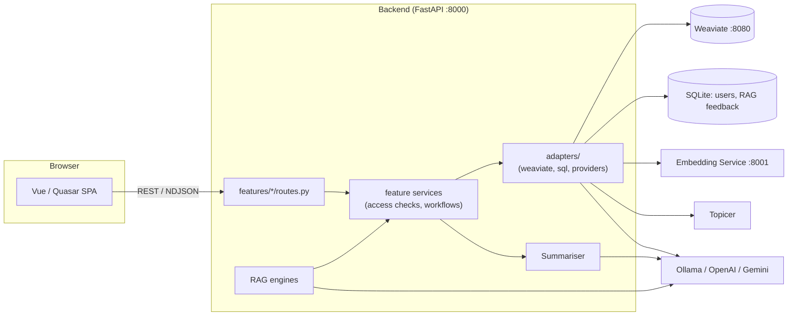

# semANT — Demo Application 

**Quezio** (working name: semANT demo) is a web application for semantic exploration of digitised Czech cultural-heritage texts. It combines full-text, vector and hybrid search over a Weaviate database with LLM-powered summarisation, Retrieval-Augmented Generation (RAG), and AI-assisted text tagging.

> **Project ID:** DH23P03OVV060 (NAKI III programme)
> **Consortium:** Brno University of Technology · Moravian Library · Masaryk University

## Key Features

| Feature | Description |
|---|---|
| **Hybrid search** | BM25 + vector (HNSW) with configurable alpha; metadata & tag filters |
| **Summarisation** | Per-result titles, per-result summaries and overall query summary via configurable LLM |
| **RAG chat** | Multi-turn question answering with source citations; pipeline variants: `rag_generator`, `adaptive_rag`, `adaptive_rag_og`, `incremental_rag`, `agentic_rag` (recommended: `incremental_rag`) |
| **Tagging** | Manual & LLM-assisted tag propagation across user collections |
| **Tag spans** | Character-level annotations of tags inside chunks (manual `pos`/`neg` and AI-suggested `auto` spans, the latter carrying `reason` + `confidence`) |
| **AI span suggestions** | Two NDJSON-streaming endpoints (thorough / optimised) backed by the external Topicer service |
| **Span discussion chat** | Streaming assistant chat around a single span using its tag, document metadata and surrounding chunk text |
| **User collections** | Group documents (and their chunks) into named collections per user |
| **App feedback** | In-app feedback form persisted server-side as JSONL |

## Technology Stack

| Layer | Technology |
|---|---|
| Database | Weaviate 1.30 (Docker) + SQLite (async, task tracking) |
| Embeddings | `BAAI/bge-multilingual-gemma2` via dedicated FastAPI service |
| Backend | Python 3.12 · FastAPI · LangChain / LangGraph · Ollama / OpenAI / Google Gemini |
| Frontend | Vue 3 · Quasar 2 · TypeScript · Pinia · Axios |

## Repository Structure

```
semant-demo/
├── docs/                          # project documentation (see below)
├── deploy/                        # Docker Compose stack management
│   ├── docker-compose.app.yaml    # Production app stack (backend + frontend)
│   ├── docker-compose.app-test.yml  # Test app stack (CI preview environments)
│   ├── docker-compose.database.yml  # Weaviate database (production)
│   ├── docker-compose.database-test.yml  # Weaviate database (test)
│   ├── docker-compose.embedder.yml  # GPU embedding service
│   ├── Dockerfile                 # Multi-stage build for backend + frontend
│   ├── Dockerfile.embedder        # Build for the embedding service
│   ├── update.sh                  # Helper script to run docker compose with .env
│   ├── .env.example               # Environment variables template (production)
│   ├── .env.test.example          # Environment variables template (test/CI)
│   └── README.md                  # Deployment instructions
├── embedding_service/             # Gemma embedding microservice (FastAPI, port 8001)
├── semant_demo_backend/           # main API server (FastAPI, port 8000)
│   ├── semant_demo/
│   │   ├── main.py                # create_app, routers, lifespan, error mapping
│   │   ├── bootstrap.py           # per-app resources: SQL engine, Weaviate repositories, providers
│   │   ├── config.py              # Config (read once from the environment or a mapping)
│   │   ├── core/errors.py         # NotFoundError, InvalidRequestError, IncompleteWriteError
│   │   ├── features/              # one package per feature: routes.py, service.py, schemas.py
│   │   │   ├── collections/       # collections, sharing, membership, access.py (rights checks)
│   │   │   ├── documents/         # public corpus reads, collection-scoped document reads
│   │   │   ├── annotations/       # tags, spans, offsets, AI suggestions, span chat
│   │   │   └── search/            # search service, filters
│   │   ├── adapters/              # concrete storage and provider clients
│   │   │   ├── weaviate/          # repositories (collections, documents, tags, spans,
│   │   │   │                      # chunk_tags, search), client, paging, writes
│   │   │   ├── sql/               # SQL Base, tables, user lookups, RAG feedback table
│   │   │   ├── embeddings/        # embedding service client
│   │   │   ├── topicer/           # Topicer span-proposal client
│   │   │   └── llm/               # Responses API streaming (span chat)
│   │   ├── routes/                # DI (dependencies.py) and routes outside features:
│   │   │                          # rag, summarizer, feedback, user search
│   │   ├── schema/                # shared corpus models (documents, chunks), write outcomes
│   │   ├── schemas.py             # RAG/feedback HTTP models, CollectionNames
│   │   ├── ollama_proxy.py        # round-robin Ollama client
│   │   ├── configs/               # YAML configs (summariser prompts, search filters)
│   │   ├── llm_api/               # async LLM abstraction (OpenAI, Ollama)
│   │   ├── rag/                   # RAG implementations + YAML configs
│   │   ├── summarization/         # search-result summariser (Jinja2 templates)
│   │   ├── maintenance/           # chunk tag audit (explicit, reviewed cleanup)
│   │   ├── users/                 # FastAPI Users (auth model, manager, JWT)
│   │   └── utils/                 # Jinja2 template helpers
│   └── tests/                     # fast tests; integration/ (real Weaviate, `make test-integration`)
├── semant_demo_frontend/          # Vue/Quasar SPA
│   └── src/
│       ├── pages/                 # SearchPage, RagPage, FeedbackPage, AboutPage,
│       │                          # Collections/* (UserCollectionsPage,
│       │                          #   CollectionOverviewPage, CollectionDocumentsPage,
│       │                          #   CollectionTagsPage, CollectionMembersPage,
│       │                          #   xjuric31/DocumentDetailPage: the document view)
│       ├── app/                   # app shell: right sidebar, session scope
│       ├── features/              # feature code moved so far (search, collections)
│       ├── shared/api/            # API transport: backend URL, auth token, generated
│       │                          # client, NDJSON streams, errors, context guards
│       ├── stores/                # Pinia stores (user-store, collectionsStore,
│       │                          # collectionStatsStore, chunksStore,
│       │                          # documentsStore, tagsStore, tagSpansStore)
│       ├── composables/           # reusable hooks (useSpanDiscussion, useTags, …)
│       ├── repositories/          # thin wrappers over the generated API client
│       ├── generated/             # OpenAPI-generated TS client (do not edit by hand)
│       └── models.ts              # display types for annotation badges
└── weaviate_utils/                # DB bootstrap & inspection scripts
    ├── docker-compose.yml         # Weaviate container definition
    ├── build_db/                  # standalone schema + data bootstrap helpers
    ├── db_insert_jsonl.py         # bulk-insert documents + chunks from JSONL
    ├── inspect_*.py               # CLI tools to dump chunks, documents, etc.
    ├── delete_*.py                # CLI tools for cleaning collections
    └── migrate.py                 # schema-migration helpers
```

## Architecture Overview


```mermaid
flowchart LR
    subgraph Browser
        FE[Vue / Quasar SPA]
    end

    subgraph Backend ["Backend (FastAPI :8000)"]
        API["features/*/routes.py"]
        SVC["feature services<br/>(access checks, workflows)"]
        RAG[RAG engines]
        SUM[Summariser]
        AD["adapters/<br/>(weaviate, sql, providers)"]
    end

    EMB[Embedding Service :8001]
    WV[(Weaviate :8080)]
    SQL[(SQLite: users, RAG feedback)]
    LLM[Ollama / OpenAI / Gemini]
    TOP[Topicer]

    FE -- REST / NDJSON --> API
    API --> SVC
    SVC --> AD
    RAG --> SVC
    SVC --> SUM
    AD --> WV
    AD --> SQL
    AD --> EMB
    AD --> TOP
    AD --> LLM
    RAG --> LLM
    SUM --> LLM
```

See [docs/ARCHITECTURE.md](docs/ARCHITECTURE.md) for the current module map, access rules and
streaming behavior, and [docs/TARGET_ARCHITECTURE.md](docs/TARGET_ARCHITECTURE.md) for the
intended direction.

### Weaviate access

Weaviate is read and written only through plain repositories in
`semant_demo/adapters/weaviate/` (`UserCollectionRepository`, `DocumentRepository`,
`TagRepository`, `SpanRepository`, `ChunkTagRepository`, `ChunkSearchRepository`), built once per
application by `bootstrap.py` on one client. They take `UUID` ids, return application schemas,
return `None` for a missing object on single reads and raise `core.errors.NotFoundError` where an
operation needs one. Feature services call them after checking access; SDK filters and objects do
not leave `adapters/`.

**Collection names** are centrally managed via the `CollectionNames` model (`schemas.py`) and
initialized in `config.py` (`Chunks`, `Tag`, `UserCollection`, `Documents`, `Span`, reference
names `userCollection` and `tagToUserCollection`); repositories receive them at construction.

## Quick Start

### Starting the Stack

```bash
cd deploy
./update.sh up -d --build
```
**Note:** Requires `.env` file configured in `deploy/` directory. 

### Stopping the Stack

```bash
cd deploy
./update.sh down
```

For detailed setup instructions, advanced options, and data management, see [deploy/README.md](deploy/README.md).

### Environment Variables

| Variable | Default | Description |
|---|---|---|
| **Build arguments** | | |
| `REPO` | `https://github.com/DCGM/semant-demo.git` | Git repository to clone |
| `BRANCH` | `main` | Branch to build from |
| `BACKEND_URL` | `https://demo.semant.cz` | Public backend URL baked into the frontend bundle at build time |
| `DOMAIN` | `demo.semant.cz` | Domain name for the Traefik Host rule |
| **Weaviate** | | |
| `WEAVIATE_HOST` | `weaviate` | Weaviate hostname (in Docker Compose network) |
| `WEAVIATE_REST_PORT` | `8080` | Weaviate HTTP port |
| `WEAVIATE_GRPC_PORT` | `50051` | Weaviate gRPC port |
| **Embedding service** | | |
| `EMBEDDING_SERVICE_HOST` | `embedding-service` | Embedding service hostname (in Docker Compose network) |
| `EMBEDDING_SERVICE_PORT` | `8001` | Embedding service port |
| `GEMMA_MODEL` | `BAAI/bge-multilingual-gemma2` | HuggingFace embedding model name |
| `GPU_DEVICE` | `0` | GPU index visible to the container (`CUDA_VISIBLE_DEVICES`) |
| **Ollama** | | |
| `OLLAMA_URLS` | `http://localhost:11434` | Comma-separated Ollama endpoints |
| `OLLAMA_MODEL` | `gemma3:12b` | Ollama model |
| **OpenAI / OpenRouter** | | |
| `OPENAI_API_KEY` | _(empty)_ | OpenAI API key (works with both OpenAI and OpenRouter endpoints) |
| `OPENAI_API_URL` | `https://openrouter.ai/api/v1` | API endpoint URL ( https://api.openai.com/v1 for OpenAI, https://openrouter.ai/api/v1 for OpenRouter) |
| `OPENAI_MODEL` | `gpt-4o-mini` | Default OpenAI model |
| **Google** | | |
| `GOOGLE_API_KEY` | _(empty)_ | Google Gemini key |
| `GOOGLE_MODEL` | `gemini-2.5-pro` | Default Google model |
| **Shared LLM** | | |
| `RAG_CONFIGS_PATH` | `rag/rag_configs/configs` | Directory with RAG YAML configs |
| `SEARCH_SUMMARIZER_CONFIG` | `configs/search_summarizer.yaml` | Summariser config path |
| `MODEL_TEMPERATURE` | `0.0` | Default LLM temperature |
| `LANGCHAIN_API_KEY` | _(empty)_ | LangChain/LangSmith tracing key (optional) |
| **Application** | | |
| `SQL_DB_PATH` | `/mnt/ssd2/semant_demo_app_data` | Directory for the SQLite `tasks.db` database with user accounts and RAG feedback (mounted into the container; the name is historical) |
| `ALLOWED_ORIGIN` | `https://demo.semant.cz` | CORS origin for frontend |
| `PORT` | `8000` | Backend listen port |
| `STATIC_PATH` | `./static` | Path to built frontend assets (production) |
| `JWT_SECRET` | _(placeholder)_ | JWT signing secret — **must be overridden in production** with a long random string |
| `JWT_LIFETIME_SECONDS` | `3600` | JWT token lifetime |
| **AI assistance** | | |
| `TOPICER_URL` | `http://semant.cz:8089` | Base URL of the external Topicer span-proposal service |
| `TOPICER_CONFIG_NAME` | `openai` | Name of the Topicer-side LLM config to use |
| `TOPICER_TIMEOUT` | `600.0` | HTTP timeout (seconds) for Topicer streaming calls |
| `SPAN_CHAT_API_KEY` | _(falls back to `OPENAI_API_KEY`)_ | API key for the OpenAI-compatible endpoint used by the span discussion chat |
| `SPAN_CHAT_API_URL` | _(falls back to `OPENAI_API_URL`)_ | Base URL of the chat endpoint (override for OpenRouter / local) |
| `SPAN_CHAT_MODEL` | _(falls back to `OPENAI_MODEL`)_ | Chat model used to discuss individual spans |
| `SPAN_CHAT_TEMPERATURE` | `0.4` | Sampling temperature for the span discussion chat |
| `SPAN_CHAT_MAX_TOKENS` | `1024` | Max tokens generated per assistant reply |
| `SPAN_CHAT_CONTEXT_CHARS` | `1500` | Characters of neighbour-chunk text included around the span |
| `SPAN_CHAT_HISTORY_LIMIT` | `20` | Max chat-history messages forwarded to the LLM |

---

> **ℹ️ Universal Configuration:** Methods using the OpenAI Python package use `OPENAI_API_KEY` and `OPENAI_API_URL`. Set `OPENAI_API_URL=https://openrouter.ai/api/v1` to use OpenRouter, or the OpenAI endpoint to use OpenAI directly. Seamless integration via `ChatOpenAI` in LangChain.

## API Endpoints

The authoritative contract is the OpenAPI schema (`/docs` on a running backend,
`make api-generate` exports it and regenerates the frontend client). Login and resource
rights are checked per operation as described in [docs/ARCHITECTURE.md](docs/ARCHITECTURE.md);
public corpus reads, search without a collection, RAG and summaries work anonymously. The
`/api/ai/*` suggestion and span chat endpoints stream NDJSON.

| Method | Path | Description |
|---|---|---|
| `GET` | `/api/users/search` | Search users by username substring. |
| `POST` | `/api/tags` | Creates a tag in the collection, or returns the existing tag with the same fields. |
| `GET` | `/api/tags/{tag_uuid}` | Retrieve tag by its id |
| `DELETE` | `/api/tags/{tag_uuid}` | Deletes the tag with its annotations. |
| `PATCH` | `/api/tags/{tag_uuid}` | Updates a tag. |
| `GET` | `/api/user_collections` | Retrieves all collections for given user |
| `POST` | `/api/user_collections` | Creates user collection in weaviate db, or not if the same user collection already exists |
| `GET` | `/api/user_collections/{collection_id}` | Retrieves collection by its id |
| `PATCH` | `/api/user_collections/{collection_id}` | Updates collection name/description/color. |
| `PATCH` | `/api/collections/{collection_id}/owner` | Reassigns ownership of a collection to a different user. |
| `POST` | `/api/user_collection/{collection_id}/chunks/{chunk_id}` | Connects chunk with user collection, and the chunk's document with the collection. |
| `DELETE` | `/api/user_collection/{collection_id}/chunks/{chunk_id}` | Removes a chunk from a user collection. |
| `POST` | `/api/collections/{collection_id}/share` | Shares a collection with another user. |
| `DELETE` | `/api/collections/{collection_id}/share/{user_id}` | Revokes a collection share. |
| `GET` | `/api/collections/{collection_id}/members` | Returns the users a collection is currently shared with. |
| `GET` | `/api/user_collection/{collection_id}/stats` | Get Collection Stats |
| `DELETE` | `/api/collections/{collection_id}` | Deletes a collection with its tags and annotations. |
| `GET` | `/api/user_collection/{collection_id}/documents` | Returns documents which belong to collection given by id |
| `POST` | `/api/collections/{collection_id}/documents/{document_id}` | Adds document to collection and also links all its chunks to that collection. |
| `DELETE` | `/api/collections/{collection_id}/documents/{document_id}` | Removes a document and its chunks from a collection. |
| `GET` | `/api/collections/{collection_id}/documents/{document_id}` | Returns chunks which belong to document and collection given by id |
| `GET` | `/api/collections/{collection_id}/tags` | Returns tags which belong to collection given by id |
| `GET` | `/api/collections/{collection_id}/documents/{document_id}/stats` | Returns per-document statistics within the given collection: chunks in collection / total, annotation count, distinct tag count. |
| `GET` | `/api/collections/{collection_id}/documents/{document_id}/neighbour` | Returns the chunk immediately before (direction=prev) or after (direction=next) the given boundary_order within the document. |
| `GET` | `/api/collections/{collection_id}/documents/{document_id}/chunks` | Returns all chunks of a document with order strictly greater than order_gt and/or strictly less than order_lt. |
| `GET` | `/api/rag/configurations` | Get Avalaible Rag Configurations |
| `POST` | `/api/rag` | Rag |
| `POST` | `/api/rag/explain` | Explain Selection |
| `POST` | `/api/rag/feedback` | Save Feedback |
| `POST` | `/api/v1/feedback` | Save App Feedback |
| `POST` | `/api/summarize/{summary_type}` | Summarize |
| `POST` | `/api/question/{question_text}` | Question |
| `GET` | `/api/document/{document_id}` | Retrieves document by its id |
| `GET` | `/api/documents/browse` | Browses the corpus with pagination, filtering and sorting options. |
| `GET` | `/api/documents/{document_id}/{collection_id}/chunks` | Retrieves all chunks for one document and marks whether each chunk belongs to the selected collection. |
| `GET` | `/api/documents/{document_id}/chunks/count` | Returns the total number of chunks in the given document (public corpus data). |
| `POST` | `/api/tag_spans` | Adds new TagSpan and the matching chunk tag reference. |
| `GET` | `/api/tag_spans` | Get stored TagSpans of a collection, optionally for one chunk. |
| `POST` | `/api/tag_spans/batch` | Get stored TagSpans of a collection for multiple chunk IDs in a single request. |
| `PATCH` | `/api/tag_spans/{span_id}` | Update TagSpan's information (start, end, tagId, ...), then re-derive the chunk tag references of its (chunk, tag) pair (and the new pair on a tag change), so saving again retries a failed chunk tag update. |
| `DELETE` | `/api/tag_spans/{span_id}` | Delete a TagSpan and the chunk tag reference no other span backs. |
| `POST` | `/api/tag_spans/bulk_update` | Apply the same :class:`PatchSpan` to many spans in one round-trip. |
| `POST` | `/api/tag_spans/in_document/delete` | Bulk-delete approved (``type == 'pos'``) spans for the given tag ids within a single (collection, document) scope. |
| `POST` | `/api/ai/suggest_spans/thorough` | Thorough AI span suggestion: every collection chunk in the document is sent to the LLM together with all selected tags. |
| `POST` | `/api/ai/suggest_spans/optimized` | Optimized AI span suggestion: per tag, the Topicer service uses vector similarity to pre-filter only the most relevant chunks before invoking the LLM. |
| `POST` | `/api/ai/suggest_spans/selection` | Run AI span suggestion on a single user-selected passage that may span multiple chunks of the collection. |
| `POST` | `/api/ai/auto_spans/delete` | Bulk-delete unresolved AI proposals (``type == 'auto'``) within a single (collection, document) for the given tag UUIDs. |
| `POST` | `/api/ai/discuss_span` | Stream an assistant reply discussing whether the given span fits its tag. |
| `GET` | `/api/search/filters` | Get Available Search Filters |
| `POST` | `/api/search` | Search |
| `POST` | `/api/auth/jwt/login` | Auth:Jwt.Login |
| `POST` | `/api/auth/jwt/logout` | Auth:Jwt.Logout |
| `POST` | `/api/auth/register` | Register:Register |
| `GET` | `/api/users/me` | Users:Current User |
| `PATCH` | `/api/users/me` | Users:Patch Current User |
| `GET` | `/api/users/{id}` | Users:User |
| `PATCH` | `/api/users/{id}` | Users:Patch User |
| `DELETE` | `/api/users/{id}` | Users:Delete User |
| `GET` | `/health` | Health |

## Testing

See [CONTRIBUTING.md](CONTRIBUTING.md#2-setup-and-commands). From the repository root:

```bash
make check             # offline: Ruff, fast pytest suite, ESLint, vue-tsc, Vitest, API client drift
make test-integration  # real-Weaviate tests in a throwaway container (Docker)
make test-e2e          # Playwright smoke suite with fake AI providers (Docker)
```

## Further Documentation

| Document | Description |
|---|---|
| [docs/VISION.md](docs/VISION.md) | Project vision, goals and user personas |
| [docs/ARCHITECTURE.md](docs/ARCHITECTURE.md) | Detailed architecture, RAG pipelines, data flow |
| [docs/DATABASE.md](docs/DATABASE.md) | Weaviate schema and the SQL tables (users, RAG feedback) |
| [docs/DEPLOYMENT.md](docs/DEPLOYMENT.md) | Production deployment and configuration guide |
| [docs/RIGHT_SIDEBAR.md](docs/RIGHT_SIDEBAR.md) | Frontend right sidebar and how to add page specific tools to it |
| [docs/TODO.md](docs/TODO.md) | Recommended improvements and known technical debt |
| [docs/DEVELOPMENT.md](docs/DEVELOPMENT.md) | Local development databases and test store rules |
| [docs/TARGET_ARCHITECTURE.md](docs/TARGET_ARCHITECTURE.md), [docs/adr/](docs/adr/README.md) | Architectural intent and decisions |
| [CONTRIBUTING.md](CONTRIBUTING.md), [AGENTS.md](AGENTS.md) | Contribution rules, checks, agent instructions |

## Contribution Guidelines

1. Create an issue **and** a branch with the same name.
2. Issue should contain: descriptive title, short summary, technical checklist, verification steps.
3. Work on your branch; write notes/questions as issue comments.
4. Write or update tests (see [CONTRIBUTING.md](CONTRIBUTING.md#4-testing-contract)); run `make check`.
5. Update relevant documentation; add/update diagrams where appropriate.
6. Merge `main` into your branch, resolve conflicts.
7. Open a pull request, assign a reviewer.
8. After approval, merge/rebase and delete the branch.
