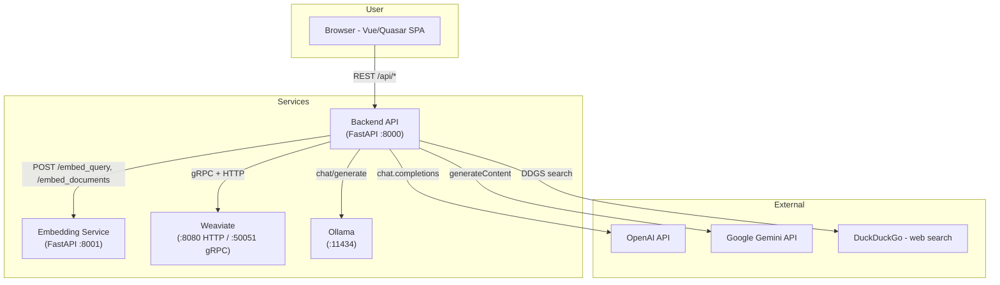
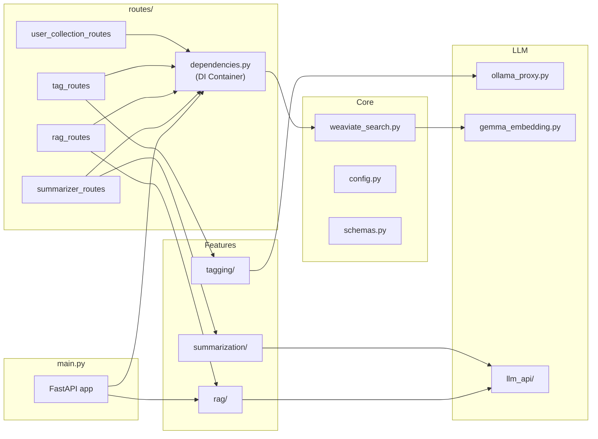
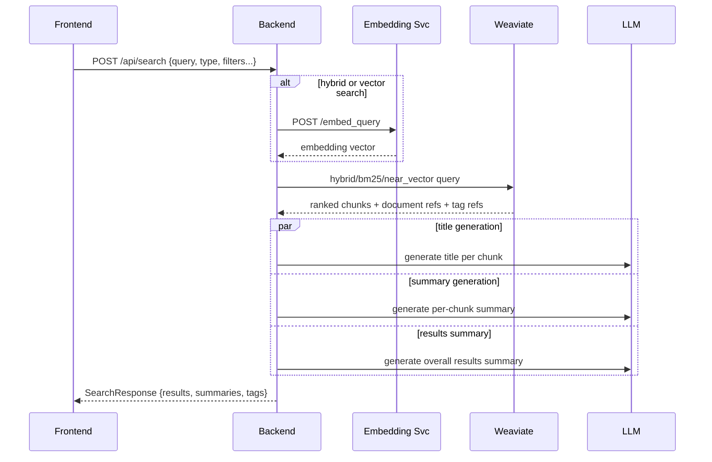
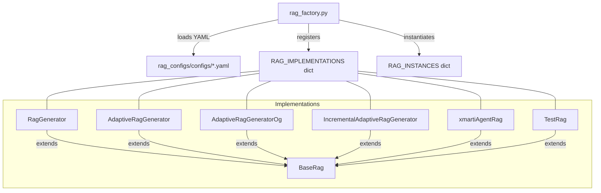
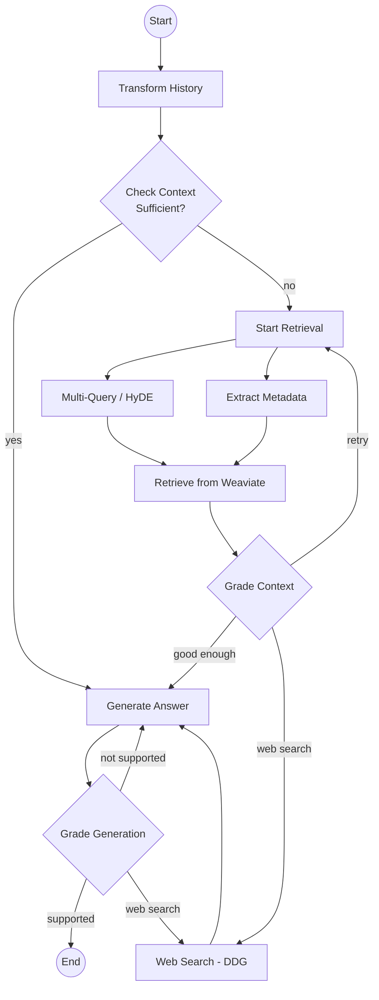
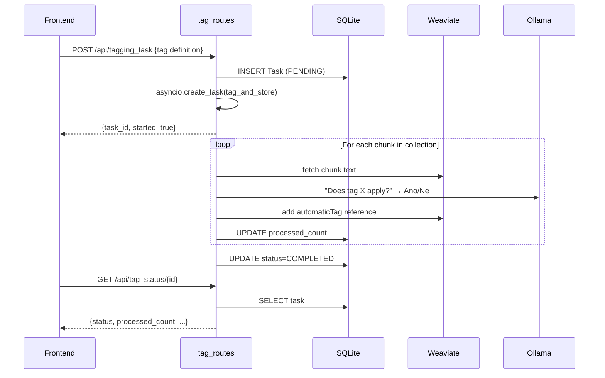

# Architecture

## System Overview

The application follows a microservice-like architecture with four independently deployable components:



## Component Details

### 1. Embedding Service (`embedding_service/`)

A lightweight FastAPI server that wraps `BAAI/bge-multilingual-gemma2` via `sentence-transformers`. Runs on GPU for fast inference.

| Endpoint | Input | Output |
|---|---|---|
| `POST /embed_query` | `{"query": "..."}` | `{"embedding": [float…]}` |
| `POST /embed_documents` | `{"texts": ["...", ...]}` | `{"embeddings": [[float…], ...]}` |

The query endpoint prepends an instruction prefix for asymmetric retrieval. Document embeddings use no prefix.

### 2. Backend API (`semant_demo_backend/`)

The main application server. Built with FastAPI, it handles:

#### Module Map



#### Configuration (`config.py`)

A singleton `Config` class that reads environment variables with sensible defaults. Key groups:

- **Weaviate connection** — host, REST port, gRPC port
- **LLM endpoints** — Ollama URLs (comma-separated for load balancing), model names, API keys
- **Application** — port, CORS origin, static file path
- **Database** — SQLite URL for task tracking
- **RAG** — config directory path

#### Dependency Injection (`routes/dependencies.py`)

FastAPI application uses a centralized dependency-injection container to manage singleton instances:

| Dependency | Manages | Lifetime |
|---|---|---|
| `get_engine()` | SQLAlchemy engine + async session factory | App startup → shutdown |
| `get_async_session()` | Database sessions for individual requests | Per-request |
| `get_search()` | Weaviate connection wrapper (`WeaviateSearch`) | First access → shutdown |
| `get_summarizer()` | Search result summarization engine | First access → shutdown |

All route handlers inject dependencies via FastAPI's `Depends()` pattern, avoiding scattered global state. The `cleanup_dependencies()` function is called during app shutdown to properly close connections.

**Example:**
```python
@exp_router.post("/api/search")
async def search(req: SearchRequest, 
                 searcher: WeaviateSearch = Depends(get_search),
                 summarizer: TemplatedSearchResultsSummarizer = Depends(get_summarizer)) -> SearchResponse:
    # searcher and summarizer are automatically injected
    ...
```

#### Application Startup & Shutdown

The FastAPI `@asynccontextmanager` lifespan handler orchestrates:

1. **Startup** (`main.py` lifespan):
   - Initialize SQLAlchemy engine and database connection pool via `get_engine()`
   - Create all required database tables (`Task`, etc.)
   - Load RAG configurations from YAML and instantiate RAG engines via `rag_factory()`

2. **Request handling** — dependency injection provides fresh database sessions and reuses long-lived connections (Weaviate, summarizer)

3. **Shutdown**:
   - Call `cleanup_dependencies()` to close Weaviate client, dispose of the database engine, and clean up resources

This ensures no resource leaks and proper initialization order.

#### Search Pipeline



Search supports three modes:
- **hybrid** — combines BM25 text matching and vector similarity (configurable `alpha`)
- **text** — BM25 only
- **vector** — cosine similarity via HNSW index

Optional HyDE (Hypothetical Document Embedding): when `is_hyde=true`, the query is embedded as a document rather than a query, which can improve recall for some use cases.

Filters: `min_year`, `max_year`, `min_date`, `max_date`, `language`, tag UUIDs (positive/automatic).

#### RAG System

RAG implementations are loaded dynamically from YAML config files via a factory pattern:



**RagGenerator** — Simple single-pass RAG: reformulate question with history → search → generate answer with citations.

**AdaptiveRagGenerator** — LangGraph-based stateful workflow with iterative search and answer grading.

**AdaptiveRagGeneratorOg** — Original AdaptiveRAG variant; stable base for experimentation.

**IncrementalAdaptiveRagGenerator** — Latest recommended variant that incrementally expands context & retrieval, with best accuracy/tuning in this branch.

**xmartiAgentRag** — Agentic workflow with tool orchestration (query expand, decomposition, retrieval quality assessment, evidence synthesis). OpenAI-based models in all RAG implementations (`rag_generator`, `adaptive_rag`, `adaptive_rag_og`, `incremental_rag`, `agentic_rag`) use `OPENAI_API_URL` for endpoint routing.



Configurable parameters per RAG config YAML:
- `model_type` — OLLAMA / OPENAI / GOOGLE
- `qt_strategy` — multi_query / hyde / step_back / nothing
- `max_retries`, `web_search_enabled`, `self_reflection`, `metadata_extraction_allowed`
- `chunk_limit`, `alpha`, `search_type`

#### Summarisation (`summarization/`)

Uses Jinja2 templates for prompt construction. Three generation tasks per search:

1. **Title** — short title per chunk, relevant to the query
2. **Query summary** — per-chunk summary of relevance to query
3. **Results summary** — overall summary across all returned chunks

Prompts are in Czech by default (application targets Czech heritage texts). All prompts and models are configurable via `configs/search_summarizer.yaml`.

#### Tagging (`tagging/`)

LLM-assisted tag propagation:

1. User creates a **Tag** (name, definition, examples, colour, pictogram).
2. User starts a **tagging task** — the system iterates over all chunks in the tag's collection.
3. For each chunk, the LLM is asked whether the tag applies (binary Ano/Ne decision).
4. Results stored as `automaticTag` references on chunks in Weaviate.
5. Users can approve (→ `positiveTag`) or reject automatic tags.
6. Task progress tracked in SQLite (`Task` model) with polling endpoint.

#### LLM API Abstraction (`llm_api/`)

A `classconfig`-based abstraction supporting:
- **OpenAsyncAPI** — async OpenAI-compatible client with rate-limit retry and concurrency semaphore
- **OllamaAsyncAPI** — async Ollama client

Both implement `process_single_request(APIRequest) → APIOutput`, which standardises model, messages, temperature and response format.

### 3. Frontend (`semant_demo_frontend/`)

Vue 3 + Quasar 2 SPA with TypeScript. Key pages:

| Route | Page | Description |
|---|---|---|
| `/search/` | SearchPage | Main search interface with filters, results, summaries |
| `/rag/` | RagPage | Multi-turn RAG chat with source citations |
| `/tag/` | TaggingPage | Tagging interface (referenced in routes but **file missing**) |
| `/tag_manage/` | TagManagementPage | Create tags, start/monitor tagging tasks |
| `/collection_manage/` | UserCollectionManagementPage | Manage user document collections |
| `/about/` | AboutPage | Project information |

State management via Pinia stores (`user-store`, `chunk_collection-store`). API communication through a shared Axios instance with configurable `BACKEND_URL`.

### 4. Weaviate + Utilities (`weaviate_utils/`)

Weaviate runs via Docker Compose with persistent storage. Utility scripts:

| Script | Purpose |
|---|---|
| `db_insert_jsonl.py` | Create schema + bulk-insert documents and chunks from JSONL + numpy embeddings |
| `inspect_chunks.py` | Dump chunks (pretty or JSON) |
| `inspect_documents.py` | Dump documents (pretty or JSON) |
| `inspect_all.py` | Inspect all collections |
| `update_metadata.py` | Batch-update document metadata |

## Request Flow Examples

### Tagging Task Lifecycle


