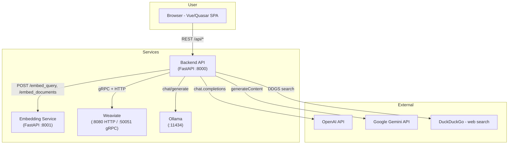
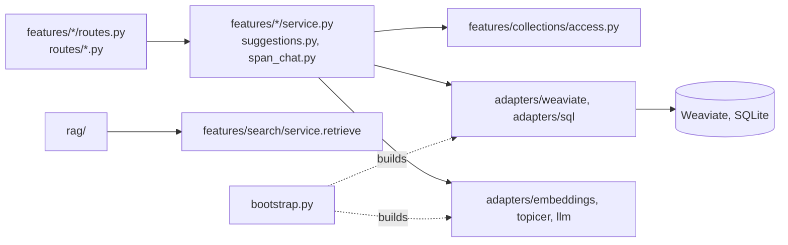
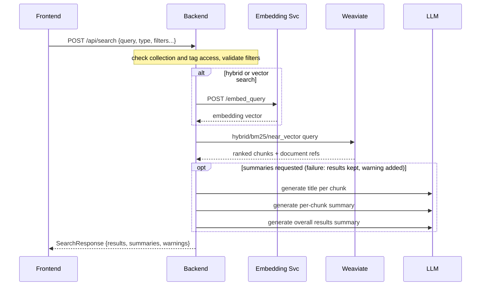
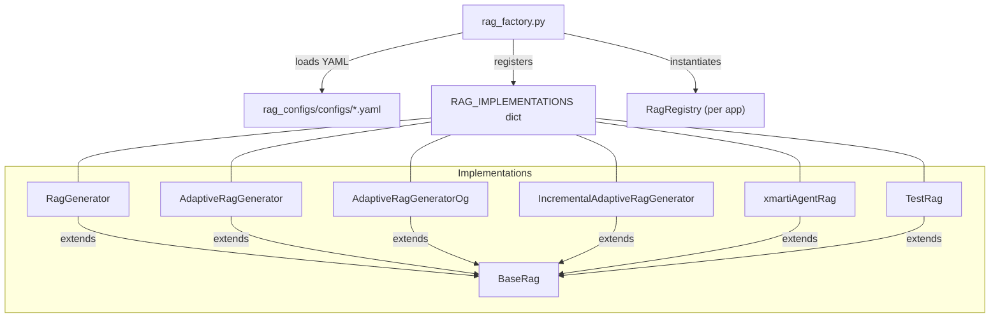
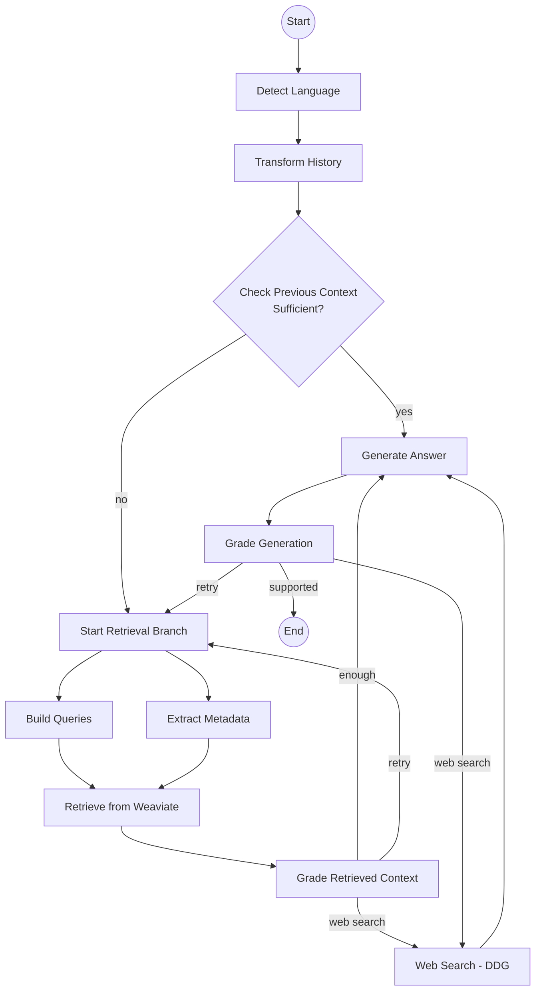

# Architecture

This document describes the implemented application architecture. Ongoing design
principles are in [TARGET_ARCHITECTURE.md](TARGET_ARCHITECTURE.md), adopted
decisions in the [ADRs](adr/README.md), and outstanding work in
[TODO.md](TODO.md). Historical design and delivery records are
[archived](archive/refactor-2026/README.md).

## System Overview

One FastAPI backend and one Vue/Quasar frontend, alongside separately deployed services
(Weaviate, the embedding service, Ollama, Topicer) and external AI APIs:


```mermaid
flowchart TB
    subgraph User
        Browser[Browser - Vue/Quasar SPA]
    end

    subgraph Services
        BE["Backend API<br/>(FastAPI :8000)"]
        EMB["Embedding Service<br/>(FastAPI :8001)"]
        WV["Weaviate<br/>(:8080 HTTP / :50051 gRPC)"]
        OLLAMA["Ollama<br/>(:11434)"]
    end

    subgraph External
        OPENAI[OpenAI API]
        GOOGLE[Google Gemini API]
        DDG[DuckDuckGo - web search]
    end

    Browser -- "REST /api/*" --> BE
    BE -- "POST /embed_query, /embed_documents" --> EMB
    BE -- "gRPC + HTTP" --> WV
    BE -- "chat/generate" --> OLLAMA
    BE -- "chat.completions" --> OPENAI
    BE -- "generateContent" --> GOOGLE
    BE -- "DDGS search" --> DDG
```

## Component Details

### 1. Embedding Service (`embedding_service/`)

A lightweight FastAPI server that wraps `BAAI/bge-multilingual-gemma2` via `sentence-transformers`. Runs on GPU for fast inference.

| Endpoint | Input | Output |
|---|---|---|
| `POST /embed_query` | `{"query": "..."}` | `{"embedding": [float…]}` |
| `POST /embed_documents` | `{"texts": ["...", ...]}` | `{"embeddings": [[float…], ...]}` |

The query endpoint prepends an instruction prefix for asymmetric retrieval. Document embeddings use no prefix.

### 2. Backend API (`semant_demo_backend/`)

The main application server. Built with FastAPI, it handles:

#### Module Map

The backend is one application organized by feature ([ADR 0001](adr/0001-simple-feature-monolith.md)).
Routes parse HTTP and call one service function; services check access and coordinate work;
concrete storage and provider clients live in `adapters/` and are built by `bootstrap.py`.

```text
semant_demo_backend/semant_demo/
  main.py                 create_app, router registration, lifespan, error mapping
  bootstrap.py            AppResources: SQL engine, Weaviate repositories, providers (per app)
  config.py               Config (read once from the environment or an explicit mapping)
  opentelemetry.py        OTLP logs/traces/metrics (off unless OTEL_ENABLED), request logging middleware
  core/errors.py          NotFoundError (404), InvalidRequestError (400), IncompleteWriteError (500)
  features/
    collections/          routes, service, access (rights checks, ADR 0007), schemas
    documents/            routes, service: public corpus reads, collection-scoped document reads
    annotations/          tags and spans (routes, service, offsets, schemas),
                          AI suggestions (suggestions, suggestion_routes), span chat (span_chat, span_chat_routes)
    search/               routes, service, filters, schemas
  adapters/
    weaviate/             one repository per concern: collections, documents, tags, spans,
                          chunk_tags, search; client, paging, writes (best-effort cascades)
    sql/                  base (declarative Base), tables (create_tables), users (UserLookup), feedback
    embeddings/gemma.py   embedding service client
    topicer/client.py     Topicer client
    llm/responses.py      OpenAI-compatible Responses API streaming (span chat)
  routes/                 dependencies.py (DI from AppResources) and the routes not yet in a
                          feature: rag, summarizer, feedback, user search
  schema/                 shared corpus models (documents, chunks) and write outcomes
  schemas.py              RAG/feedback HTTP models, CollectionNames
  rag/, summarization/, llm_api/, ollama_proxy.py   RAG pipelines, search summaries, LLM clients
  users/                  FastAPI Users: model, manager, auth routers, schemas
  maintenance/            chunk_tag_audit, metadata_sync (reviewed report, explicit apply)
```


```mermaid
flowchart LR
    Routes["features/*/routes.py<br/>routes/*.py"] --> Services["features/*/service.py<br/>suggestions.py, span_chat.py"]
    Services --> Access["features/collections/access.py"]
    Services --> Adapters["adapters/weaviate, adapters/sql"]
    Services --> Providers["adapters/embeddings, topicer, llm"]
    RAG["rag/"] --> Search["features/search/service.retrieve"]
    Bootstrap["bootstrap.py"] -. builds .-> Adapters
    Bootstrap -. builds .-> Providers
    Adapters --> Stores[("Weaviate, SQLite")]
```

Dependencies are one-way: Documents, Search and Annotations use the Collections access
functions; RAG uses Search's authorized retrieval; nothing imports RAG. No service reaches
a raw Weaviate or OpenAI client: SDK objects stay inside `adapters/`.

#### Configuration (`config.py`)

A `Config` class that reads settings once, at construction, from the process environment or from an explicit mapping (`Config(environ={...})`, used by tests). `create_app(config)` stores it on `app.state.config`; routes and bootstrap read it through the `get_config` dependency. The process-wide `config` instance is only the entry-point configuration: `semant_demo.main:app`, `run.py` and the standalone scripts (`create_default_configurations.py`, `rag/rag_runner_demo.py`) read it; application code uses the app's `Config`. Key groups:

- **Weaviate connection** — host, REST port, gRPC port
- **LLM endpoints** — Ollama URLs (comma-separated for load balancing), model names, API keys
- **Application** — port, CORS origin, static file path, `LOG_LEVEL`
- **Observability** — `OTEL_ENABLED` (default off) and the `OTEL_*` / `DEPLOYMENT_ENVIRONMENT` export settings; see [OBSERVABILITY.md](OBSERVABILITY.md)
- **Database** — `SQL_DB_URL` (default `sqlite+aiosqlite:///tasks.db`, relative to the working directory) for user accounts and RAG answer feedback (the file name `tasks.db` is historical; deployments mount it, so it is kept)
- **Auth** — `JWT_SECRET` (override in production with a long random string), `JWT_LIFETIME_SECONDS`
- **RAG** — config directory path
- **AI assistance** — `TOPICER_URL` / `TOPICER_CONFIG_NAME` / `TOPICER_TIMEOUT` for the external Topicer span-proposal service; `SPAN_CHAT_*` group for the OpenAI-compatible "discuss this span" chat (`SPAN_CHAT_API_KEY`, `SPAN_CHAT_API_URL`, `SPAN_CHAT_MODEL` — all falling back to the corresponding `OPENAI_*` values — plus `SPAN_CHAT_TEMPERATURE`, `SPAN_CHAT_MAX_TOKENS`, `SPAN_CHAT_CONTEXT_CHARS`, `SPAN_CHAT_HISTORY_LIMIT`)

#### Application resources (`bootstrap.py`, `routes/dependencies.py`)

`bootstrap.AppResources` holds the application-scoped resources of one running app. The lifespan creates it, stores it on `app.state.resources`, and closes it at shutdown. At startup it opens the one Weaviate client of the app (`adapters/weaviate/client.connect_weaviate`, which also checks readiness); startup fails if Weaviate cannot be reached. `create_app(config, weaviate_connector=...)` replaces the connector in tests. The dependency functions in `routes/dependencies.py` read from it:

| Dependency | Manages | Lifetime |
|---|---|---|
| `get_config()` | The app's `Config` | App lifetime |
| `get_async_session()` | Database sessions for individual requests | Per-request |
| `get_user_lookup()` | SQL user lookups (`adapters/sql/users.UserLookup`) on a request session | Per-request |
| `get_documents()`, `get_tags()`, `get_collections()` | Weaviate repositories (`adapters/weaviate/`) | Startup → shutdown |
| `get_annotation_store()` | The repositories the Annotations service uses (collections, tags, spans, chunk tags, documents) | Startup → shutdown |
| `get_search_backends()` | Search adapter, collection/tag repositories and the embedding client for the search service and RAG retrieval | Startup → shutdown |
| `get_topicer()`, `get_span_chat()` | Topicer client; Responses API client for span chat | Startup → shutdown |
| `get_summarizer()` | Search result summarization engine | First access → shutdown |
| `get_rag_registry()` | Configured RAG instances | Startup → shutdown |

Requests that need these resources while the lifespan is not running get HTTP 503.

**Example** (the route only parses HTTP; the service checks access before any read):
```python
@exp_router.get("/api/documents/{document_id}/{collection_id}/chunks", response_model=DocumentDetail)
async def fetch_document_chunks(document_id: str, collection_id: str,
                                documents: DocumentRepository = Depends(get_documents),
                                collections: UserCollectionRepository = Depends(get_collections),
                                current_user: User = Depends(current_active_user)) -> DocumentDetail:
    return await service.read_chunks_in_collection(documents, collections, current_user, document_id, collection_id)
```

#### Application Startup & Shutdown

The FastAPI `@asynccontextmanager` lifespan handler orchestrates:

1. **Startup** (`main.py` lifespan):
   - Create `AppResources` (SQLAlchemy engine and session factory, provider clients; nothing external is contacted)
   - Create missing SQL tables (`user`, `rag_user_feedback`; `adapters/sql/tables.create_tables` never drops or alters existing tables)
   - Open the Weaviate client and build the repositories (startup fails if Weaviate is not ready)
   - Load RAG configurations from YAML and instantiate RAG engines via `rag_factory()`

2. **Request handling** — dependency injection provides fresh database sessions and reuses long-lived connections (Weaviate, summarizer)

3. **Shutdown** (also after a failed startup):
   - `AppResources.close()` closes the Weaviate client if one was opened, disposes of the database engine, and drops cached resources, so the same app can be started again.
   - When telemetry is enabled, the providers are flushed and the instrumentation removed.

`create_app()` and `app.openapi()` do not connect to Weaviate, SQL, or AI providers; `export_openapi.py` relies on this. With `OTEL_ENABLED=true`, `create_app()` also sets up the process-wide OpenTelemetry providers and exporters (export runs in the background; an unreachable collector does not fail requests), so a process should create one such app.

#### Authentication (`users/`)

User accounts are managed with [FastAPI Users](https://fastapi-users.github.io/fastapi-users/) using JWT Bearer tokens. User records are stored in the SQL database at `SQL_DB_URL` (SQLite by default), next to the RAG feedback table.

| Module | Responsibility |
|---|---|
| `users/models.py` | SQLAlchemy `User` table (on `adapters/sql/base.Base`) — UUID PK, email, hashed password, active/superuser/verified flags, plus `username` (unique, indexed), `name`, `institution` |
| `users/schemas.py` | Pydantic `UserRead` / `UserCreate` / `UserUpdate` schemas (all include the extra fields as optional) |
| `users/manager.py` | `UserManager` — overrides `authenticate()` to accept **email or username** at login; lifecycle hooks (`on_after_register`, etc.) |
| `users/auth.py` | JWT strategy, `FastAPIUsers` instance, exported routers; exports `current_active_user` (mandatory) and `current_active_optional_user` (optional) dependency shortcuts |

**API endpoints:**

| Method | Path | Description |
|---|---|---|
| `POST` | `/api/auth/register` | Create a new account (email, password, username, name, institution) |
| `POST` | `/api/auth/jwt/login` | Login with **email or username** — returns `access_token` |
| `POST` | `/api/auth/jwt/logout` | Logout (client discards token) |
| `GET` | `/api/users/me` | Current user info (requires Bearer token) |
| `PATCH` | `/api/users/me` | Update current user (email / password / name / institution) |

**Route-level authentication:**

Routes authenticate; services authorize ([ADR 0007](adr/0007-access-and-collaboration.md)). Two dependencies are used:

| Dependency | Behaviour | Applied to |
|---|---|---|
| `current_active_user` | Mandatory — returns `401` if no valid token | Collection, tag, span, AI suggestion, span chat, collection-scoped document reads, user search |
| `current_active_optional_user` | Optional — `None` when unauthenticated | Public corpus reads and search, RAG, summaries (these services refuse collection- or tag-scoped requests from anonymous users) |

Resource rights (owner, shared user, admin) are checked by the feature services through
`features/collections/access.py`: shared users may read and annotate (spans, tag definitions)
but not change membership, metadata or sharing. Public corpus reads (`GET /api/document/{id}`,
`/api/documents/browse` without a collection, `/api/documents/{id}/chunks/count`, search
without collection and tags) need no login. RAG, `/api/summarize/results` and
`/api/question/{text}` are public too and call LLM providers with client-supplied text;
this existing product behavior is tracked for an access/cost decision in [#234](https://github.com/DCGM/semant-demo/issues/234).

The JWT secret is configured via the `JWT_SECRET` environment variable (default is a placeholder — **must be overridden in production**).

#### Search Pipeline


```mermaid
sequenceDiagram
    participant FE as Frontend
    participant BE as Backend
    participant EMB as Embedding Svc
    participant WV as Weaviate
    participant LLM as LLM

    FE->>BE: POST /api/search {query, type, filters...}
    Note over BE: check collection and tag access, validate filters
    alt hybrid or vector search
        BE->>EMB: POST /embed_query
        EMB-->>BE: embedding vector
    end
    BE->>WV: hybrid/bm25/near_vector query
    WV-->>BE: ranked chunks + document refs
    opt summaries requested (failure: results kept, warning added)
        BE->>LLM: generate title per chunk
        BE->>LLM: generate per-chunk summary
        BE->>LLM: generate overall results summary
    end
    BE-->>FE: SearchResponse {results, summaries, warnings}
```

Search supports three modes:
- **hybrid** — combines BM25 text matching and vector similarity (configurable `alpha`)
- **text** — BM25 only
- **vector** — cosine similarity via HNSW index

Optional HyDE (Hypothetical Document Embedding): when `is_hyde=true`, the query is embedded as a document rather than a query, which can improve recall for some use cases.

Filters: configured `filters` (docs/SEARCH_FILTERS.md) or the legacy `min_year`, `max_year`, `language` fields (`min_date`/`max_date` are accepted but not applied), `user_collection_id`, and tag UUIDs matched as positive and/or automatic chunk tags. A collection needs read access; every tag must belong to a collection the user can read (to `user_collection_id`, if given), otherwise 404 "Tag not found" (401 when anonymous). Without collection and tags, search covers the public corpus, also anonymously. The search feature (`features/search/service.py`) does access, normalization, embedding and optional summaries; `adapters/weaviate/search.py` builds and runs the Weaviate query. RAG reuses `service.retrieve` without summaries.

#### RAG System

RAG implementations are loaded dynamically from YAML config files via a factory pattern:


```mermaid
flowchart TD
    FACTORY[rag_factory.py] -->|loads YAML| CONFIGS[rag_configs/configs/*.yaml]
    FACTORY -->|registers| REGISTRY["RAG_IMPLEMENTATIONS dict"]
    FACTORY -->|instantiates| INSTANCES["RagRegistry (per app)"]

    subgraph Implementations
        RG[RagGenerator] -->|extends| BASE[BaseRag]
        ARG[AdaptiveRagGenerator] -->|extends| BASE
        AOG[AdaptiveRagGeneratorOg] -->|extends| BASE
        IR[IncrementalAdaptiveRagGenerator] -->|extends| BASE
        AR[xmartiAgentRag] -->|extends| BASE
        TR[TestRag] -->|extends| BASE
    end

    REGISTRY --- RG & ARG & AOG & IR & AR & TR
```

**RagGenerator** — Simple single-pass RAG: reformulate question with history → search → generate answer with citations.

**AdaptiveRagGenerator** — LangGraph-based stateful workflow with iterative retrieval and answer grading.

**AdaptiveRagGeneratorOg** — Original AdaptiveRAG variant; stable base for experimentation.

**IncrementalAdaptiveRagGenerator** — Current production-ready variant that incrementally expands retrieval, grades context and outputs, and uses fallback search strategies when the initial retrieval is insufficient.

**xmartiAgentRag** — Agentic workflow with tool orchestration (query expansion, decomposition, retrieval quality assessment, evidence synthesis).

#### Incremental RAG:

```mermaid
flowchart TD
    START((Start)) --> DET[Detect Language]
    DET --> TH[Transform History]
    TH --> CC{Check Previous Context<br/>Sufficient?}

    CC -->|yes| GEN[Generate Answer]
    CC -->|no| SRB[Start Retrieval Branch]

    SRB --> MQ[Build Queries]
    SRB --> EM[Extract Metadata]
    MQ --> RET[Retrieve from Weaviate]
    EM --> RET
    RET --> GC[Grade Retrieved Context]

    GC -->|enough| GEN
    GC -->|retry| SRB
    GC -->|web search| WS[Web Search - DDG]

    WS --> GEN
    GEN --> GG[Grade Generation]

    GG -->|supported| END((End))
    GG -->|retry| SRB
    GG -->|web search| WS
```

IncrementalAdaptiveRagGenerator is implemented as a `langgraph` state machine. The workflow is:
- detect the question language first, then choose Czech/English prompt templates
- rewrite conversational history into a standalone search question only when history exists
- if the request includes `previous_documents`, optionally reuse them and skip retrieval when a context sufficiency check passes
- otherwise enter an incremental retrieval branch with explicit iteration state:
  - retrieval iteration 0 uses the original query and a small chunk limit
  - retrieval iteration 1 generates multiple query variants for broader coverage
  - retrieval iteration 2 performs a HyDE-style search with the query treated like a document embedding and a higher hybrid alpha
- metadata extraction runs only on the second retrieval iteration when `metadata_extraction_allowed` is true, to infer year/language filters from the question text
- retrieval results are deduplicated and, when enough candidates exist, the returned chunks are graded for relevance before answer generation
- if no relevant documents remain, the router retries retrieval or falls back to DuckDuckGo web search when enabled
- answer generation uses history-aware prompts if conversation history exists
- the generated answer is graded for completeness, and incomplete responses can trigger another retrieval pass or web search fallback

This incremental RAG process is more resilient than a single-pass pipeline: it adapts retrieval strategy based on result quality, tightens search with inferred metadata, and validates both retrieved evidence and the final answer before finishing.

Configurable parameters per RAG config YAML include:
- `model_type` — OLLAMA / OPENAI / GOOGLE
- `api_key`, `model_name`, `temperature`
- `chunk_limit`, `alpha`, `search_type`
- `max_retries`, `web_search_enabled`, `metadata_extraction_allowed`

#### Summarisation (`summarization/`)

Uses Jinja2 templates for prompt construction. Three generation tasks per search:

1. **Title** — short title per chunk, relevant to the query
2. **Query summary** — per-chunk summary of relevance to query
3. **Results summary** — overall summary across all returned chunks

Prompts are in Czech by default (application targets Czech heritage texts). All prompts and models are configurable via `configs/search_summarizer.yaml`.

#### Tags and Tag Spans (`features/annotations/`, `adapters/weaviate/spans.py`, `adapters/weaviate/tags.py`)

Tags can additionally be anchored to specific character ranges inside a chunk via the `Span` collection. Three span types coexist:

- `pos` — manually confirmed positive span (created by a human reviewer).
- `neg` — manually rejected span (negative example, useful for AI training/filtering).
- `auto` — AI-proposed span; carries optional `reason` (LLM justification) and `confidence` ∈ `[0, 1]`.

Spans are stored with two Weaviate cross-references — `tag` → `Tag` and `text_chunk` → `Chunks` — rather than as plain UUID properties. The backend lazily ensures `reason`/`confidence` properties exist on legacy collections (`SpanRepository._ensure_ai_properties`).

The Annotations feature (`features/annotations/service.py`) owns tag and span use cases: access checks (read: collection read; spans: annotation edit; tags: tag-definition edit — owner and shared users), offset validation, the span write followed by the chunk tag re-derivation, and partial outcomes. Routes only parse HTTP; `adapters/weaviate/spans.py` and `tags.py` only read and write. AI suggestions (`suggestions.py`, below) save validated proposals and delete suggestions through the same service.

Coordinates (`features/annotations/offsets.py`, frontend twin `src/utils/spanOffsets.ts`, shared cases in `semant_demo_backend/tests/fixtures/text_offsets.json`): a span is stored on the chunk where it starts; `start`/`end` are half-open UTF-16 code-unit offsets (the browser's `String.length`) from the start of that chunk's text. `end` may exceed the chunk: the span continues into the following chunks of the document while their `order` is consecutive, whether or not they are in the collection. Span creation and offset changes are rejected with 400 when `start` is negative or not inside the anchor chunk, the span is empty, it crosses a gap in chunk order, or it ends after the document's text. Changes that do not touch offsets (approve, reject, retag) do not re-check stored offsets.

Tag creation inserts the tag and then links it to its collection; when the link fails the new tag is deleted again and the request fails with 500 (`step: link_collection`; if that deletion fails too, `step: delete_unlinked_tag` and the detail says an unreachable tag may remain). Tag and collection deletion keep 204 on success; when a step fails they answer 500 with `detail`, `step`, `completed` (counts of completed steps) and `uncertain`, keep the completed deletions, and deleting again continues.

REST surface (all under `/api/tag_spans`): `POST`, `GET` (filter by chunk/tag/collection), `POST /batch`, `PATCH /{id}`, `DELETE /{id}`, `POST /bulk_update`, `POST /in_document/delete` (delete spans for given tags inside a single document).

Tag-filtered search reads the chunk references `automaticTag` / `positiveTag` / `negativeTag`, not the spans. These references are derived from the spans: a chunk references tag `T` through the property matching span type `auto` / `pos` / `neg` exactly when at least one such span with tag `T` is anchored on the chunk (a cross-chunk span is anchored on its first chunk; indexing following chunks is deferred to [#224](https://github.com/DCGM/semant-demo/issues/224)). The lists follow the spans' current type: `automaticTag` holds tags with unresolved AI suggestions, so approving a suggestion moves the tag from the chunk's `automaticTag` list to its `positiveTag` list unless another `auto` span of that tag remains. Every span create, update (also offset-only, so saving again retries) and delete (single, bulk, scoped and AI) re-derives the references of the (chunk, tag) pairs it touched (`adapters/weaviate/chunk_tags.py`). Within one process the re-derivation of a pair runs one at a time (`ChunkTagRepository`), so concurrent writes on the same pair end consistent; with several worker processes they can still leave it stale. That second write is best effort: on failure the span write is kept and the response reports a `partial` outcome with an `update_chunk_tags` step. Existing inconsistencies are reported, and corrected only on request, by `python -m semant_demo.maintenance.chunk_tag_audit` (see DEVELOPMENT.md).

#### AI Assistance (`features/annotations/suggestions.py`, `suggestion_routes.py`, `span_chat.py`, `span_chat_routes.py`, `adapters/topicer/`, `adapters/llm/`)

External AI integrations that produce or critique spans. All streaming endpoints use NDJSON (`application/x-ndjson`) so the frontend can render partial results incrementally.

**Topicer span proposal.** `adapters/topicer/client.py` (`TopicerClient`, built by bootstrap from `TOPICER_URL` — default `http://topicer:8089` — `TOPICER_CONFIG_NAME` and `TOPICER_TIMEOUT`) is an async `httpx` client for the Topicer service. Topicer returns proposed `(tag, start, end, reason, confidence)` per chunk. The workflow (`features/annotations/suggestions.py`) is request-scoped (ADR 0003): a `prepare_*` function checks annotation-edit access and the tag/document/chunk scope and loads tags and chunks before the stream starts (a denied request makes no provider call); iterating the run calls Topicer (at most 10 calls of a run at a time), validates each proposal (its tag must be a requested tag, its chunk a chunk of the document in the collection, its offsets `0 <= start < end <= len(text sent)`, read as code points and stored as UTF-16 units; invalid proposals are rejected, not clamped), saves each valid one as an `auto` span with its chunk tag, and yields a `result` event after the write. The route only encodes events as NDJSON. Each stream ends with an `end` event (`outcome` complete / partial / failed, counts of saved, rejected, failed saves, chunk tag failures and provider failures); a stream without it was interrupted. Failures do not stop the run and nothing is rolled back. On client disconnect the route closes the run: running Topicer calls are cancelled and awaited, a span write in progress finishes first, saved spans remain. Running again stores duplicate `auto` spans for identical proposals (no comparison with stored spans).

| Route | Topicer call | Behaviour |
|---|---|---|
| `POST /api/ai/suggest_spans/thorough` | `POST /v1/tags/propose/texts` (per chunk) | One call per chunk of the document in the collection with all requested tags; one `result` line per chunk in completion order. Slower but resilient to per-chunk failures. |
| `POST /api/ai/suggest_spans/optimized` | `POST /v1/tags/propose/db/stream` (per tag) | Topicer pre-filters chunks by vector similarity and streams them; one `result` line per returned chunk, tags one after another. Proposals on chunks outside the collection are rejected. |
| `POST /api/ai/suggest_spans/selection` | `POST /v1/tags/propose/texts` (once) | The user's selection (UTF-16 offsets over the selected chunks' concatenated text); one `result` line per proposal. Spans are anchored on the chunk where they start; their end counts the document's chunks in between, also those outside the collection. |
| `POST /api/ai/auto_spans/delete` | — | Cleanup endpoint: deletes the `auto` spans of the given tags in one document of the collection. |

Reviewers then approve (`pos`) or reject (`neg`) suggestions through the standard span endpoints.

The frontend (`src/composables/useAiAssistance.ts`) reads the stream with `postNdjson` (`src/shared/api/ndjson.ts`), shows saved suggestions as they arrive and reports partial, failed and interrupted runs. Each run carries a token; changing document or collection aborts it and its late events no longer change the store, errors or loading state.

**Span discussion chat.** `features/annotations/span_chat.py` checks collection read access for the span before the stream starts (a denied request reads no context and makes no provider call), then reads the context through the repositories and builds a system prompt around the span — tag definition + examples, host document metadata, the span's text with `<<<SPAN>>>`/`<<<END_SPAN>>>` markers, and a window of surrounding context (`SPAN_CHAT_CONTEXT_CHARS` characters from the same and neighbouring chunks of the document; a cross-chunk span is assembled from the following chunks) — and streams the reply from an OpenAI-compatible Responses API endpoint (`adapters/llm/responses.ResponsesChat`, built by bootstrap from the `SPAN_CHAT_*` settings). The route `POST /api/ai/discuss_span` returns `SpanChatDelta` NDJSON lines ending with `{"done": true}`, or `{"error": ...}` when reading the context or the provider failed after the stream started. Nothing is stored; the client sends the whole history each turn (the last `SPAN_CHAT_HISTORY_LIMIT` messages are used).

#### LLM API Abstraction (`llm_api/`)

A `classconfig`-based abstraction supporting:
- **OpenAsyncAPI** — async OpenAI-compatible client with rate-limit retry and concurrency semaphore
- **OllamaAsyncAPI** — async Ollama client

Both implement `process_single_request(APIRequest) → APIOutput`, which standardises model, messages, temperature and response format.

### 3. Frontend (`semant_demo_frontend/`)

Vue 3 + Quasar 2 SPA with TypeScript. Key pages:

| Route | Page | Description |
|---|---|---|
| `/search` | `SearchPage` | Main search interface with filters, results, summaries |
| `/rag` | `RagPage` | Multi-turn RAG chat with source citations |
| `/collections` | `Collections/UserCollectionsPage` | List user collections |
| `/collections/:cid/overview` | `Collections/CollectionOverviewPage` | Collection summary & stats |
| `/collections/:cid/documents` | `Collections/CollectionDocumentsPage` | Documents inside a collection |
| `/collections/:cid/tags` | `Collections/CollectionTagsPage` | Tags scoped to the collection |
| `/collections/:cid/tagging_jobs` | `Collections/CollectionTaggingJobsPage` | Placeholder page (no behavior; the old tagging jobs were removed) |
| `/collections/:cid/members` | `Collections/CollectionMembersPage` | Collection sharing / role management |
| `/collections/:cid/documents/:did/v1` | `Collections/xjuric31/DocumentDetailPage` | Document view (text, annotations, AI suggestions, span chat) |
| `/collections/:cid/documents/:did/v2` | — | Redirects to the document view (the retired V2 variant) |
| `/feedback` | `FeedbackPage` | In-app feedback form |
| `/about` | `AboutPage` | Project information |

State management via Pinia stores (`user-store`, `collectionsStore`, `collectionStatsStore`, `chunksStore`, `documentsStore`, `tagsStore`, `tagSpansStore`). Reusable streaming logic lives in `composables/` (e.g. `useSpanDiscussion` for the NDJSON span chat).

All network calls go through `src/shared/api`: one backend origin (`BACKEND_URL`), one bearer-token source, the OpenAPI-generated TypeScript client (`src/generated/`, via `useApi()`, used directly or through `repositories/`) and `postNdjson()` for the NDJSON streams (span suggestions, span discussion), which sends the same token and turns a refused request into an `ApiError` with the backend's `detail`. There is no other HTTP client. State that belongs to a context (collection, document, search, conversation) drops answers that arrive after the context changed (`createContextGuard`/`createScope`); signing out clears user-scoped stores (`app/session.ts`). The app-level right sidebar (`app/sidebar/`) hosts page tools such as the search summary; see [RIGHT_SIDEBAR.md](RIGHT_SIDEBAR.md). Owner-only collection controls are hidden for shared users (`features/collections/permissions.ts`, mirroring the backend rules).

### 4. Weaviate + Utilities (repository root `weaviate_utils/`)

Weaviate runs via Docker Compose with persistent storage. Standalone maintenance scripts (not
part of the backend package; several delete or rewrite data — check the endpoint first, see
DEVELOPMENT.md):

| Script | Purpose |
|---|---|
| `db_insert_jsonl.py` | Create schema + bulk-insert documents and chunks from JSONL + numpy embeddings |
| `inspect_chunks.py` | Dump chunks (pretty or JSON) |
| `inspect_documents.py` | Dump documents (pretty or JSON) |
| `inspect_all.py` | Inspect all collections |

Document metadata from the Kramerius PostgreSQL mirror is synchronized by the backend
command `python -m semant_demo.maintenance.metadata_sync` (read-only report, then explicit
apply; source library only — see DEVELOPMENT.md and DATABASE.md).

## Historical material

The old SQL-tracked background tagging tasks (`tagging/`, `Task` model, `/api/tag/task*`
polling) are retired; AI suggestions are request-scoped
([ADR 0003](adr/0003-request-scoped-ai.md)). [TagSpans_benchmark.md](TagSpans_benchmark.md) and
`weaviate_benchmarks/` are historical measurements, not a description of current behavior.
