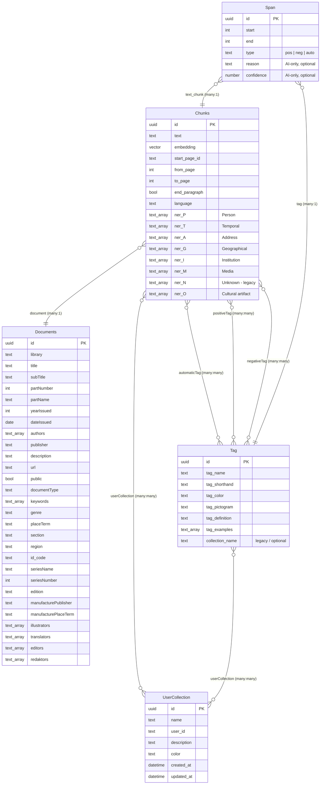

# Database Schema

The application uses two databases:

1. **Weaviate** — primary vector + document store (collections, references, HNSW index)
2. **SQLite** — lightweight task-tracking for async tagging jobs

---

## Weaviate Schema



### Collection: `Documents`

Stores bibliographic metadata for each digitised document (book, periodical issue, etc.). No vector index — documents are not directly searchable by similarity.

Key fields:
- `library` — source digital library identifier (e.g. `"mzk"`)
- `yearIssued` / `dateIssued` — used for temporal filtering
- `authors` — array of author names
- `documentType`, `genre`, `keywords` — categorical metadata
- `url` — link back to the source digital library page
- `public` — whether the document is publicly accessible

### Collection: `Chunks`

The core searchable collection. Each chunk is a contiguous text block (typically paragraph-level, may span pages) with:

- **HNSW vector index** — pre-computed embeddings from `BAAI/bge-multilingual-gemma2`
- `text` — the full chunk text (also used for BM25)
- `from_page` / `to_page` — page range in the source document
- `start_page_id` — UUID of the first page
- `ner_*` — named entity arrays extracted by NER (Persons, Temporal, Address, Geographical, Institution, Media, Cultural artifacts)

#### References from Chunks

| Reference | Target | Cardinality | Description |
|---|---|---|---|
| `document` | Documents | 1 | Parent document |
| `automaticTag` | Tag | many | Tags assigned by LLM |
| `positiveTag` | Tag | many | Tags approved by user |
| `negativeTag` | Tag | many | Tags rejected by user |
| `userCollection` | UserCollection | many | User collections containing this chunk |

### Collection: `Tag`

User-defined tags with:
- `tag_name`, `tag_shorthand` — display name and abbreviation
- `tag_color`, `tag_pictogram` — UI presentation
- `tag_definition` — text description used by LLM for tagging
- `tag_examples` — example texts (used in LLM prompt)
- `collection_name` — legacy/optional string in existing data; ownership is primarily modeled via `userCollection` reference

### Collection: `UserCollection`

Named collections of chunks per user:
- `name` — user-provided collection name
- `user_id` — owner identifier
- `description` — optional description
- `color` — UI color identifier
- `created_at`, `updated_at` — timestamps managed by backend

### Collection: `Span`

Character-level annotations of a tag inside a single chunk. Spans drive both the manual highlighting UI and the AI-assisted tagging workflow.

Properties:
- `start` (`INT`) — character offset (inclusive) inside the chunk text
- `end` (`INT`) — character offset (exclusive)
- `type` (`TEXT`, enum `SpanType`) — one of:
  - `pos` — manually confirmed positive span
  - `neg` — manually rejected span (negative example)
  - `auto` — AI-proposed span awaiting review
- `reason` (`TEXT`, optional) — natural-language justification produced by the AI tagger; only set on `auto` spans
- `confidence` (`NUMBER`, optional) — model self-reported confidence in `[0, 1]`; only set on `auto` spans

References:

| Reference | Target | Cardinality | Description |
|---|---|---|---|
| `tag` | Tag | 1 | The tag this span instantiates |
| `text_chunk` | Chunks | 1 | The chunk inside which the span lives |

> **Lazy schema migration.** Older deployments created the `Span` collection without `reason` / `confidence`. The backend (`Span._ensure_ai_properties` in `weaviate_utils/span.py`) idempotently adds these properties on first AI-write, so no manual migration is required.

> **Cascade on tag/chunk delete.** Deleting a Tag or a Chunk also removes all Spans referencing them; this is enforced by the backend (`weaviate_utils/helpers.py`, `delete_span_cascade`) rather than by Weaviate itself.

---

## SQLite Schema

SQLite holds two tables, both created automatically at startup via `TasksBase.metadata.create_all`.

### `tasks` — Asynchronous tagging jobs

```sql
CREATE TABLE tasks (
    taskId          VARCHAR(36)  PRIMARY KEY,   -- UUID
    status          VARCHAR(20)  DEFAULT 'PENDING',  -- PENDING | RUNNING | COMPLETED | FAILED
    result          JSON,                        -- final result or error
    all_texts_count INTEGER,                     -- total chunks to process
    processed_count INTEGER,                     -- chunks processed so far
    collection_name VARCHAR,                     -- target chunk collection
    tag_id          VARCHAR(36),                 -- UUID of the tag being applied
    tag_processing_data JSON,                    -- per-chunk tagging details
    time_updated    DATETIME,                    -- auto-updated timestamp
    task_name       VARCHAR                      -- asyncio task name (for cancellation)
);
```

Task lifecycle: `PENDING` → `RUNNING` → `COMPLETED` / `FAILED`

The backend polls this table via `GET /api/tag/task/status/{taskId}` and the frontend uses periodic polling to display progress.

### `user` — User accounts (FastAPI Users)

```sql
CREATE TABLE user (
    id              VARCHAR(36)  PRIMARY KEY,   -- UUID
    email           VARCHAR      NOT NULL UNIQUE,
    hashed_password VARCHAR      NOT NULL,
    is_active       BOOLEAN      NOT NULL DEFAULT TRUE,
    is_superuser    BOOLEAN      NOT NULL DEFAULT FALSE,
    is_verified     BOOLEAN      NOT NULL DEFAULT FALSE,
    username        VARCHAR(100) UNIQUE,        -- optional, indexed; accepted at login
    name            VARCHAR(200),               -- display name
    institution     VARCHAR(300)                -- optional affiliation
);
```

Users authenticate with a JWT Bearer token (via FastAPI Users). Login accepts **email or username**. Token lifetime is 7 days; the secret is set via the `JWT_SECRET` environment variable.

---

## Data Ingestion

Data is loaded using `weaviate_utils/db_insert_jsonl.py`:

```bash
python db_insert_jsonl.py \
    --source-dir /path/to/data \
    --delete-old \
    --document-collection Documents \
    --chunk-collection Chunks \
    --tag-collection Tag \
    --usercollection-collection UserCollection
```

Expected input directory structure:
```
source-dir/
├── *.json          # one JSON per document (bibliographic metadata)
├── *.jsonl         # one JSONL per document (one line per chunk)
└── *_embeddings.npy  # numpy array of embeddings matching JSONL line order
```

The script:
1. Scans JSONL files to discover attribute keys
2. Creates Weaviate collections with appropriate data types
3. Inserts documents, then chunks with vector embeddings
4. Establishes `document` references from chunks to their parent documents
