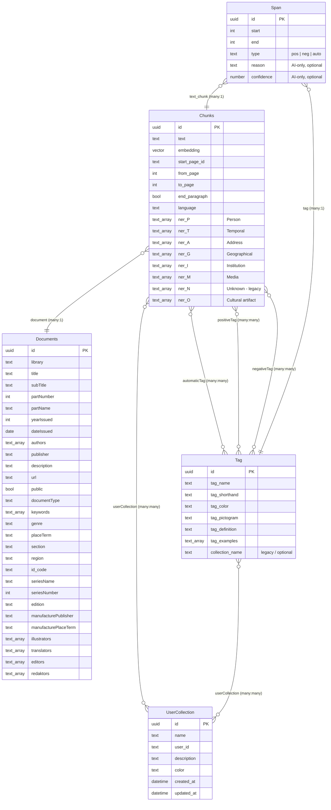

# Database Schema

The application uses two databases:

1. **Weaviate** — primary vector + document store (collections, references, HNSW index)
2. **SQLite** — lightweight task-tracking for async tagging jobs

---

## Weaviate Schema


```mermaid
erDiagram
    Documents {
        uuid id PK
        text library
        text title
        text subTitle
        int partNumber
        text partName
        int yearIssued
        date dateIssued
        text_array authors
        text publisher
        text description
        text url
        bool public
        text documentType
        text_array keywords
        text genre
        text placeTerm
        text section
        text region
        text id_code
        text seriesName
        int seriesNumber
        text edition
        text manufacturePublisher
        text manufacturePlaceTerm
        text_array illustrators
        text_array translators
        text_array editors
        text_array redaktors
    }

    Chunks {
        uuid id PK
        text text
        vector embedding
        text start_page_id
        int from_page
        int to_page
        bool end_paragraph
        text language
        text_array ner_P "Person"
        text_array ner_T "Temporal"
        text_array ner_A "Address"
        text_array ner_G "Geographical"
        text_array ner_I "Institution"
        text_array ner_M "Media"
        text_array ner_N "Unknown - legacy"
        text_array ner_O "Cultural artifact"
    }

    Tag {
        uuid id PK
        text tag_name
        text tag_shorthand
        text tag_color
        text tag_pictogram
        text tag_definition
        text_array tag_examples
        text collection_name "legacy / optional"
    }

    UserCollection {
        uuid id PK
        text name
        text user_id
        text description
        text color
        datetime created_at
        datetime updated_at
    }

    Span {
        uuid id PK
        int start
        int end
        text type "pos | neg | auto"
        text reason "AI-only, optional"
        number confidence "AI-only, optional"
    }

    Chunks }o--|| Documents : "document (many:1)"
    Chunks }o--o{ Tag : "automaticTag (many:many)"
    Chunks }o--o{ Tag : "positiveTag (many:many)"
    Chunks }o--o{ Tag : "negativeTag (many:many)"
    Chunks }o--o{ UserCollection : "userCollection (many:many)"
    Tag }o--o{ UserCollection : "userCollection (many:many)"
    Span }o--|| Tag : "tag (many:1)"
    Span }o--|| Chunks : "text_chunk (many:1)"
```

### Collection: `Documents`

Stores bibliographic metadata for each digitised document (book, periodical issue, etc.). No vector index — documents are not directly searchable by similarity.

The property list in the diagram above is older than the local development snapshot
(`local_data/`, checked 2026-10-08), which stores `author` (`text[]`), `subtitle`,
`partNumber` (`text`), `url` (`uuid`), `placeOfPublication`, `editors`, `seriesName`,
`seriesNumber` (`text`), `edition`, `illustrators`, `translators`, `redaktors` and has no
`library`, `authors`, `subTitle`, `description`, `keywords`, `genre`, `placeTerm`,
`section`, `region` or `id_code`. Deployed databases were not checked. The API reads every
store through one model, `schema/documents.Document`: the snapshot's properties plus the
older `library`, `description`, `keywords` (`text[]`), `genre` and `placeTerm`. Properties
a store lacks are absent from the answer; stored properties the model does not name (e.g.
`authors`, `subTitle`, `manufacturePublisher`) are not returned, as before #208.

Key fields:
- `library` — source digital library identifier (e.g. `"mzk"`)
- `yearIssued` / `dateIssued` — used for temporal filtering
- `authors` — array of author names
- `documentType`, `genre`, `keywords` — categorical metadata
- `url` — in the local snapshot (`uuid`) the Kramerius record UUID, equal to the document
  id, not a link; resolving library-specific source links is [#255](https://github.com/DCGM/semant-demo/issues/255)
- `public` — whether the document is publicly accessible

#### Document metadata from the Kramerius mirror

`python -m semant_demo.maintenance.metadata_sync` ([DEVELOPMENT](DEVELOPMENT.md#kramerius-metadata-sync))
fills these properties from the `meta_records` row of the document's source library
(`semant_demo/maintenance/kramerius_mapping.py`). MODS values (`metadata_json`) list the
record's own values before its ancestors'; "first" is the first non-empty one, "all" every
distinct value in that order. A field is written only if the collection declares one of
its property names (the first declared one is used) and the value fits the declared type;
otherwise the report lists it as undeclared or skipped.

| Field | Source (same row only) | Property names (current, older) | API (`Document`) |
|---|---|---|---|
| title | `title`, else first MODS `Title` | `title` | yes |
| titleMetadata | first MODS `Title` | `titleMetadata` | no (stored provenance) |
| subtitle | first `Subtitle` | `subtitle`, `subTitle` | `subtitle` |
| partNumber, partName | first `PartNumber`, `PartName` | same (`partNumber` `text` or `int`) | yes |
| dateIssued | day of `date` (else MODS `DateIssued`), only when it names the day and lies in yearIssued; midnight UTC | `dateIssued` | yes |
| yearIssued | year of `date`, else of `start_date`/`end_date` in one year, else of MODS `DateIssued`; ranges give none | `yearIssued` | yes |
| dateIssuedMetadata, yearIssuedMetadata | MODS `DateIssued` alone | same | no (stored provenance) |
| author | all `Author` | `author`, `authors` | `author` |
| editors, illustrators, translators, redaktors | all `Editor`, `Illustrator`, `Translator`, `Redaktor` | same | yes |
| publisher, language, seriesName, edition | first `Publisher`, `Language` (code as normalized by the MODS parser), `SeriesName`, `Edition` | same | yes |
| seriesNumber | first `SeriesNumber` (text such as "IV" kept) | `seriesNumber` (`text` or `int`) | yes |
| placeOfPublication | first `PlaceTerm` | `placeOfPublication`, `placeTerm` | yes |
| manufacturePublisher, manufacturePlaceTerm | first `ManufacturePublisher`, `ManufacturePlaceTerm` | same | no (stored only) |
| documentType | `record_type` | `documentType` | yes |
| public | `public`; changed only with `--update-access` | `public` | yes |
| library | the selected library | `library` | yes |

`url` and chunk `language` are not written. `in_library` of the selected row is shown in the
report but does not change anything. Of the stores checked, the local snapshot declares no
`library` property, so its documents need a library map and keep no stored provenance.

### Collection: `Chunks`

The core searchable collection. Each chunk is a contiguous text block (typically paragraph-level, may span pages) with:

- **HNSW vector index** — pre-computed embeddings from `BAAI/bge-multilingual-gemma2`
- `text` — the full chunk text (also used for BM25)
- `from_page` / `to_page` — page range in the source document
- `start_page_id` — UUID of the first page
- `ner_*` — named entity arrays extracted by NER (Persons, Temporal, Address, Geographical, Institution, Media, Cultural artifacts)
- classifications (`text[]`, e.g. `communicative_mode`, `style`, `subject_domain`) — written by `data_tools/meta_data_enrichment`; the properties named in `features/search/filters.py::TASK_CLASSES` are search filters and are returned as a hit's `metadata` ([SEARCH_FILTERS](SEARCH_FILTERS.md#5-classifications-on-search-hits))

#### References from Chunks

| Reference | Target | Cardinality | Description |
|---|---|---|---|
| `document` | Documents | 1 | Parent document |
| `automaticTag` | Tag | many | Tags of `auto` spans anchored on this chunk (unresolved AI suggestions) |
| `positiveTag` | Tag | many | Tags of `pos` spans anchored on this chunk (approved) |
| `negativeTag` | Tag | many | Tags of `neg` spans anchored on this chunk (rejected) |
| `userCollection` | UserCollection | many | User collections containing this chunk |

The three tag references are what tag-filtered search uses. They are derived from the
`Span` collection: a chunk holds a tag reference exactly when at least one span of the
matching type with that tag is anchored on the chunk (its `text_chunk` reference). The
lists follow the spans' current type: approving a suggestion (`auto` → `pos`) moves its
tag from `automaticTag` to `positiveTag` unless another `auto` span of that tag remains;
`automaticTag` does not record that the AI once proposed an approved tag. Span
writes maintain this; a reference without such a span is a data inconsistency, not a
supported legacy state (ADR 0004). `python -m semant_demo.maintenance.chunk_tag_audit`
reports inconsistencies.

### Collection: `Tag`

User-defined tags with:
- `tag_name`, `tag_shorthand` — display name and abbreviation
- `tag_color`, `tag_pictogram` — UI presentation
- `tag_definition` — text description used by LLM for tagging
- `tag_examples` — example texts (used in LLM prompt)
- `collection_name` — legacy/optional string in existing data; ownership is primarily modeled via `userCollection` reference

### Collection: `UserCollection`

Named collections of chunks per user:
- `name` — user-provided collection name
- `user_id` — owner identifier
- `description` — optional description
- `color` — UI color identifier
- `created_at`, `updated_at` — timestamps managed by backend

### Collection: `Span`

Character-level annotations of a tag inside a single chunk. Spans drive both the manual highlighting UI and the AI-assisted tagging workflow.

Properties:
- `start` (`INT`) — character offset (inclusive) inside the chunk text
- `end` (`INT`) — character offset (exclusive)
- `type` (`TEXT`, enum `SpanType`) — one of:
  - `pos` — manually confirmed positive span
  - `neg` — manually rejected span (negative example)
  - `auto` — AI-proposed span awaiting review
- `reason` (`TEXT`, optional) — natural-language justification produced by the AI tagger; only set on `auto` spans
- `confidence` (`NUMBER`, optional) — model self-reported confidence in `[0, 1]`; only set on `auto` spans

References:

| Reference | Target | Cardinality | Description |
|---|---|---|---|
| `tag` | Tag | 1 | The tag this span instantiates |
| `text_chunk` | Chunks | 1 | The chunk inside which the span lives |

> **Lazy schema migration.** Older deployments created the `Span` collection without `reason` / `confidence`. The backend (`SpanRepository._ensure_ai_properties` in `adapters/weaviate/spans.py`) idempotently adds these properties on first AI-write, so no manual migration is required.

> **Cascade on tag delete.** Deleting a Tag (also as part of deleting its collection) first removes the chunk tag references to it, then its Spans, then the Tag; this is done by the backend (`adapters/weaviate/writes.py`) rather than by Weaviate itself. It is not atomic: a failed step keeps the completed deletions and is reported, and deleting again continues.

---

## SQLite Schema

The SQL database (`SQL_DB_URL`, SQLite file `tasks.db` by default — the name is historical)
holds two application tables, declared on `adapters/sql/base.Base` and created at startup by
`adapters/sql/tables.create_tables` when missing: `user` (below) and `rag_user_feedback` (likes /
dislikes of RAG answers, `adapters/sql/feedback.py`). Startup never drops or alters existing
tables or rows.

Databases created before the refactor may also contain a `tasks` table from the removed
background tagging jobs. Nothing reads or writes it any more; it is left in place (dropping it
would be a separate, reviewed data change).

### `user` — User accounts (FastAPI Users)

```sql
CREATE TABLE user (
    id              VARCHAR(36)  PRIMARY KEY,   -- UUID
    email           VARCHAR      NOT NULL UNIQUE,
    hashed_password VARCHAR      NOT NULL,
    is_active       BOOLEAN      NOT NULL DEFAULT TRUE,
    is_superuser    BOOLEAN      NOT NULL DEFAULT FALSE,
    is_verified     BOOLEAN      NOT NULL DEFAULT FALSE,
    username        VARCHAR(100) UNIQUE,        -- optional, indexed; accepted at login
    name            VARCHAR(200),               -- display name
    institution     VARCHAR(300)                -- optional affiliation
);
```

Users authenticate with a JWT Bearer token (via FastAPI Users). Login accepts **email or username**. Token lifetime is 7 days; the secret is set via the `JWT_SECRET` environment variable.

---

## Data Ingestion

Data is loaded using `weaviate_utils/db_insert_jsonl.py`:

```bash
python db_insert_jsonl.py \
    --source-dir /path/to/data \
    --delete-old \
    --document-collection Documents \
    --chunk-collection Chunks \
    --tag-collection Tag \
    --usercollection-collection UserCollection
```

Expected input directory structure:
```
source-dir/
├── *.json          # one JSON per document (bibliographic metadata)
├── *.jsonl         # one JSONL per document (one line per chunk)
└── *_embeddings.npy  # numpy array of embeddings matching JSONL line order
```

The script:
1. Scans JSONL files to discover attribute keys
2. Creates Weaviate collections with appropriate data types
3. Inserts documents, then chunks with vector embeddings
4. Establishes `document` references from chunks to their parent documents
