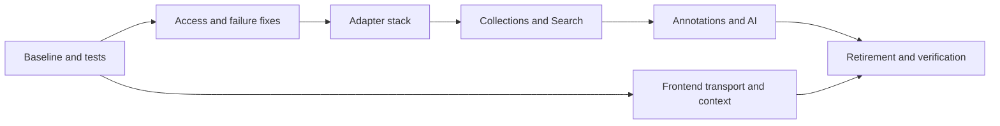

# Refactor plan

Status: 
No stages below are claimed complete.
Baseline: `main` at `375caa5f7f68defba25a56cccbb7dbc7fdf99a13`.

Current implementation progress, temporary states, and discovered follow-up work are tracked in [REFACTOR_STATUS.md](REFACTOR_STATUS.md).

## 1. Scope

Deliver a small feature-oriented application, reliable local/CI checks, explicit access
and partial-outcome behavior, and reusable frontend context/transport boundaries.
Preserve the current product while preparing for the supplied search, document-viewer,
sidebar, annotation, and collection roadmap.

Do not include a SQL migration of collaboration data, a durable queue, automatic repair,
new microservices, a universal repository hierarchy, a new tag-search representation,
mandatory geometry/provenance fields, or the entire feature backlog.

[Review notes](adr/REVIEW_NOTES.md) contain pinned evidence and confidence limits.
[Confirmed decisions](adr/README.md#confirmed-decisions) settle Q1-Q5: shared annotation
editing without membership editing; chunk-attribute tag search; retrieved-result search
chat; local progressive annotation UI; and line-level mapping as future viewer work.
These are constraints to preserve, not unresolved prerequisites. Remaining implementation
details belong to the relevant feature PR and do not block unrelated cleanup.

## 2. Preserve these facts when integrating open PRs

| PR | Reviewed head | Integration requirement |
| --- | --- | --- |
| #182 | `5344e02573aeded9ae25c9f1dae1d38268c27b88` | Starts the repository cleanup; revise mandatory CRUD inheritance and unsupported methods. Rebase against current main. |
| #184 | `9c2dd637b67780cdae22903ade245d0baf8973e4` | Based on #182; retain useful validation/error fixes, test explicit null/empty PATCH behavior, and address capped tag deduplication separately. |
| #187 | `d09eb7c1cec7669a7bf86daad6ef92d27e7feafb` | Based on #184; preserve sharing, current chunk endpoints, and current-main pagination during rebase. Keep mutation-aware traversal. |

All three were open at review time. Their test checklists are author reports, not proof
that current contracts or new behavior are covered. Current main already added collection
listing pagination; do not re-report that specific omission as unfixed. Recheck refs
before merging because this is a pinned snapshot, not a live status tracker.

## 3. Delivery stages

### R0 - Reproducible baseline and test infrastructure

Owner: one developer for toolchain/CI coordination; others can prepare independent tests.

Record the current API/OpenAPI shape and existing tests. Pin a compatible Python/Node/
Quasar/Vite/test-tool/generator combination, separate development dependencies, and
introduce the documented root commands. Do not silently upgrade every dependency.
Make SQL settings injectable, provide a minimal testable app factory, and avoid live
resource creation for schema export. Replace auth-test ordering/global reload dependencies
with independent fixtures. Add offline provider fakes and isolated database configuration.

Implement the testing matrix in CONTRIBUTING, with detailed cases in
[ADR 0005](adr/0005-testing-contract.md): fast, real-store integration, browser smoke,
and opt-in live evaluation. Add the critical fixture corpus. Make required failures
block merge/release; exclude generated code where appropriate. Keep PR execution away
from production credentials, including on self-hosted infrastructure.

Provide a thin root Makefile (not a custom build system) with the following **proposed**
commands. Document underlying tool commands for environments without Make. Do not
advertise these targets as available before they exist.

| Target | Contract |
| --- | --- |
| `make setup` | Install pinned, compatible development dependencies. |
| `make check` | Lint/format, types, fast offline tests, boundary checks, and API-generation drift; no live providers/GPU. |
| `make test-integration` | Provision test-owned stores, run real adapter/workflow tests, and clean up only owned data. |
| `make test-e2e` | Isolated app/stores with deterministic AI; small browser suite. |
| `make api-generate` | Connection-free OpenAPI export and deterministic pinned client generation. |
| `make dev` | Documented local profile, clearly labeling fake versus configured live AI. |

Prefer Ruff and one Python type checker; retain ESLint and add Vue-aware type checking.
Use one formatter per language. Preserve existing frontend/generator pins unless changing
them deliberately for compatibility; introduce a backend lock and separate dev dependencies.

**Exit:** a fresh checkout can run fast checks without keys/GPU, one auth test passes
alone, required suite selection is non-empty, the real-Weaviate fixture is demonstrably
isolated, frontend has real tests, and API generation is reproducible. Document remaining
legacy warnings rather than masking new failures with blanket suppression.

### R1 - Correctness fixes and access boundary

Owner: Collections/Identity reviewer; implement the confirmed permission split.

Fix the undefined `e` error branch in `add_chunk_to_collection`. Audit all collection,
tag, span, AI, document-with-collection, and sharing/member-list routes. Enforce service-level
scope checks before reads/writes/provider calls. Use direct collection lookup, not listing
as access policy. Preserve explicitly public corpus reads only where intended.
Shared users can edit annotations, including AI suggestions/review, but cannot add or
remove collection documents/chunks. Split annotation-edit and membership-edit checks;
annotation operations must not implicitly change membership. Preserve separate sharing,
owner, and explicit admin checks rather than introducing a general editor role.

Add typed partial outcomes for affected bulk operations with coordinated API/frontend
updates. Report item/step failures, including persistence failures currently hidden by AI
helpers. Add termination/no-progress guards to mutation loops. Do not add repair jobs.

**Exit:** shared annotation editing works; shared membership editing, unrelated-user,
and mixed-scope operations are denied without unauthorized reads/writes/provider calls.
Partial/total failure paths are visible and a full failing deletion page terminates.
These are behavior-fix PRs, not disguised file moves.

### R2 - Finish the adapter foundation and PR stack

Owner: one integration owner for #182 -> #184 -> #187.

Rebase in stack order and compare against current-main sharing/chunk-route behavior.
Reuse pagination/mapping helpers without forcing unsupported CRUD. Use consistent UUID
boundaries and neutral errors. Keep plain concrete adapters unless a small Protocol helps.
Move SQL user lookup out of Weaviate repositories. Preserve any changed endpoint contract
through explicit aliases/forwarders or a coordinated client change.

Move adapter implementations toward `adapters/weaviate/`, not a duplicate concrete
repository under each feature. Keep transitional imports thin with an owner and a
removal condition. Bootstrap owns connections; no asynchronous lazy global singleton
creation in request handlers. Make schema maintenance explicit and non-destructive by
default; never reuse the destructive schema-reset script as migration machinery.

**Exit:** real-store tests cover missing IDs, mappings, multi-page reads, shrinking
mutation sets, limits, and repeat attach/remove; startup/shutdown and connection-free
OpenAPI tests pass; the facade is no longer required by migrated paths.

### R3 - Migrate Collections and Search as reference features

Collections demonstrates services/access/adapters without mandatory classes. Search
demonstrates neutral filter inputs, scoped retrieval, external embedding injection, and
optional summarization. Other features call supported functions; prevent dependency cycles.

Consolidate conflicting document representations and distinguish canonical source text
from display-normalized text. Preserve old wire fields until an intentional compatible
change is reviewed. Keep retrieval reusable by RAG without mandatory summaries.

Preserve tag search through existing chunk attributes/references and current filter
options. Prove compatibility with a small real-Weaviate fixture. Fix verified annotation
mutation paths that fail to maintain those attributes in a focused correctness PR; test
multiple backing annotations and final removal. No approved-only default, reverse-span
query design, new ID-list bridge, or search-semantic redesign is part of this step.

Treat chunk tag entries without backing annotations as inconsistencies, not historical
features. Prepare a separate audit/dry-run cleanup, recheck invalid entries, and obtain
review before deleting data. Keep this separate from startup and normal requests;
do not add repair infrastructure. A production-wide audit does not block module moves.
See [ADR 0004](adr/0004-storage-and-annotation-search.md).

**Exit:** current collection/tag/category/metadata filters compose; excluded chunks cannot
appear; affected annotation mutations maintain searchable chunk tags or report partial
failure. Optional summary failure returns hits plus a warning. Service logic contains
no vendor SDK objects or raw queries.

### R4 - Extract annotation and request-scoped AI workflows

Move tag/span business rules and AI proposal orchestration out of routes/adapters into
services. Keep per-item persistence, reported partial success, bounded concurrency, and
cancel/await cleanup. Add terminal stream events and stale-request guards in the caller.
Validate provider-returned IDs and offsets against authorized input, not provider assertions.

Preserve human approvals/rejections when retrying generation. Document exact-duplicate
handling before adding automatic retry or regeneration behavior. Establish compatible
text-coordinate handling with shared Python/TypeScript fixtures; do not silently migrate
stored offsets. Keep currently supported cross-chunk spans and distinguish invalid gaps.
Preserve existing manual/automatic category semantics; do not redesign provenance during
extraction. Planned document-view/export/concordance selectors must support manual,
automatic, and both, but adding those selectors is not an R4 completion requirement.

**Exit:** failures after a saved proposal preserve it and report incomplete execution;
browser disconnect ends remaining local work; saved data reloads correctly; no stale event
updates another context; both fake-provider and real-adapter contract tests pass.

### R5 - Frontend structure and roadmap seams

Keep the current stack. Consolidate authenticated transport, NDJSON parsing, and error
handling. Partition annotation and request state by context. Extract an app-level sidebar
shell and reuse existing document rendering through explicit source/context inputs.
Do not build a general UI plugin system. Move components when touched; a whole-tree
rename is not a prerequisite for feature development.

Keep real-time behavior local to Document view: saved/streamed automatic annotations
appear immediately, with visible pending/failed work and navigation-race tests. Do not
add cross-user subscriptions, WebSockets, or a collaborative editing platform.

Prepare explicit source/context inputs so search chat can use retrieved results or an
explicitly selected subset only; it must not rerun/broaden the query. Future line-level
mapping may be frontend chunk-to-ALTO string mapping; preserve source IDs and canonical
text, and keep future polygon lists optional. No mapping engine or database geometry
migration is needed to finish R5. Add actual selected-result chat, annotation selectors,
translation/TTS, and line alignment in their roadmap increments, not as empty scaffolding.

**Exit:** existing search, annotation editing, and span chat still work; context switching
cannot leak state; sidebar/reader seams have component and browser tests; no duplicated
network configuration is introduced for future panels.

### R6 - Retire obsolete code and reconcile documentation

Inventory remaining old task routes, model types, client code, configuration, and imports
before removal. Remove obsolete job execution, not all uses of `asyncio.create_task`:
request-scoped concurrency is still legitimate. Move shared SQL Base/user infrastructure
out of task-named modules without dropping user accounts or databases. Remove dead imports,
shims, duplicate schemas, and facade access only after callers have migrated.

Keep existing `docs/ARCHITECTURE.md` descriptive and accurate, with a link to the target;
mark old queue advice and benchmark comparisons as historical where appropriate. Replace
overstated claims such as guaranteed cleanup with tested behavior. Update READMEs,
OpenAPI, setup examples, and agent instructions together.

**Exit:** full deterministic checks, relevant real-store integration tests, API regeneration,
login/sharing/search/annotation/stream browser smoke pass. Human review confirms no dropped
user data, no unintended wire changes, and no abandoned compatibility code.

## 4. Parallel work and change ownership

Frontend transport/tests may proceed while backend adapters migrate, against frozen
contracts. One owner integrates shared schemas/OpenAPI/client regeneration to reduce
conflicts; feature owners review their changes. Add CODEOWNERS entries for actual people
or teams through a separate reviewed configuration change, not invented assignments here.

Do not demand a global feature freeze. New work in a touched area follows the agreed
boundary and adds tests; large behavior changes should wait for that area's contract.
Generated output must be regenerated after rebasing, not resolved by hand.

## 5. Refactor completion, not perfection

Completion means critical workflows and boundaries are proven, no required checks are
advisory, no application service reaches into a raw SDK client, access is enforced,
partial outcomes are visible, and agreed streaming semantics are tested. Remaining
low-risk legacy code may have an explicit owner and exit issue.

It does not mean every class became a function, every dependency has a port, every file
moved, all benchmarks improved, all corpus formats were normalized, or the roadmap is
implemented. In particular, selected-result chat, manual/automatic/both selector UI,
ALTO mapping, and persisted polygons are roadmap work, not structural-refactor gates.
Release against the tested commit/artifact; preserve a rollback path for code and a
separate compatibility plan for approved persistent schema changes.
