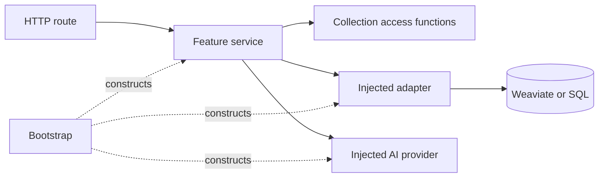

# Target architecture

Status: draft target, updated 2026-10-07 with confirmed Q1-Q5 decisions; not a
description of completed refactoring.
Baseline: `main` at `375caa5f7f68defba25a56cccbb7dbc7fdf99a13`.
See [ADRs](adr/README.md) for confirmed contracts, rationale, and deferred details.

## 1. Direction and non-goals

Keep one FastAPI application and one Vue/Quasar frontend, alongside the existing
Weaviate, embedding, and external AI services. Organize application code by feature.
Do not add microservices, a dependency-injection framework, compulsory domain layers,
or a generic plugin/event framework. Do not redesign storage as part of cleanup.

Service functions are the default. A class is useful when several operations share
injected dependencies, but is not required. Ports are small interfaces added only for
real isolation, alternative implementations, or a useful test seam. Do not create empty
`models.py`, `ports.py`, or `public.py` files to satisfy a directory template.

## 2. Backend ownership

Keep existing top-level repository names to avoid unnecessary churn.

```text
semant_demo_backend/semant_demo/
  main.py                     # create_app, HTTP registration, lifespan
  bootstrap.py                # construct/inject/close application resources
  core/
    settings.py
    errors.py
  features/
    documents/                # documents, chunks, canonical text, source locations
    collections/              # access, sharing, membership, collection metadata
    annotations/              # tags, spans, suggestions, concordances, export
    search/                   # filters, retrieval orchestration, search response
    rag/                      # chat orchestration and existing pipeline variants
  users/                      # retain current identity implementation initially
  adapters/
    weaviate/                 # concrete documents, collections, annotations, search
    sql/                      # user lookup/persistence boundary where needed
    embeddings/
    llm/
    topicer/
```

A typical feature needs only `routes.py`, `service.py`, and `schemas.py`.
Collections also has `access.py`. Existing summarization and feedback modules may stay
where they are until touched. Translation/TTS modules are added when implemented, not
as empty refactor deliverables. Feature ownership need not mirror database collections.

| Location | Responsibility | Must not own |
| --- | --- | --- |
| `routes.py` | Parse HTTP, resolve authenticated principal/dependencies, invoke service, encode HTTP/streams. | Weaviate queries, ownership rules, multi-step business workflows. |
| `service.py` | Access enforcement, use-case orchestration, partial outcomes, optional enrichment. | SDK response types, global app state, HTTP response construction. |
| `access.py` | Small shared authorization functions; load/check the requested resource directly. | Listing all collections merely to authorize one; a universal policy framework. |
| `schemas.py` | Typed feature inputs/results and HTTP models where compatible. | Unrelated global schemas and persistence configuration. |
| `adapters/weaviate/*.py` | Query/filter translation, persistence, mapping, known infrastructure failures. | SQL user lookup, authorization decisions, embedding/provider orchestration. |
| Optional `ports.py` | Narrow typed capability contracts. | Mandatory CRUD, runtime behavior, duplicate concrete implementations. |
| `bootstrap.py` | Application-scoped clients/configuration, request sessions, dependency wiring. | Business decisions or per-user mutable workflow state. |

## 3. Dependency rules



The diagram shows runtime calls. With a port, the service imports its feature's
interface and bootstrap supplies the concrete adapter. Without a port, a concrete
adapter annotation/import is allowed as a documented lightweight compromise: the
service may call only its typed application-facing methods, never its SDK client.
This is not a claim of strict dependency inversion without interfaces.

A feature can call another feature's supported functions in `service.py` or `access.py`.
Do not add pass-through `public.py` files. Keep dependencies one-way: documents/identity
provide foundational reads; collections owns access/membership; annotations and search
use these capabilities; RAG uses authorized retrieval. Search should not call RAG just
to summarize results. Extract a small genuinely shared operation if a cycle appears.
A cross-feature query adapter may optimize a join-like read without exposing SDK details.

## 4. Search boundary

The search service validates business options, authorizes scope, requests an embedding
for vector/hybrid modes, invokes retrieval, optionally summarizes, and returns hits plus
metadata/warnings. HTTP shape validation remains in request schemas. Pure retrieval must
be callable by RAG without automatically summarizing each result or creating recursion.

The Weaviate search adapter converts neutral filters into SDK filters, selects BM25,
near-vector, or hybrid calls, chooses references/properties, and maps results. Database
property names and pagination limitations remain adapter details. No embedding or LLM
calls occur inside it. A summary failure must not erase successful retrieval results.

Collection/tag restrictions must be applied during retrieval, not by dropping disallowed
items only after top-k search. Search continues to use **tags stored in chunk attributes**
in Weaviate. Preserve the current representation/options; no new span-query architecture
or approved-only search default is required by the refactor.

Chunk tags without backing annotations are data inconsistencies to remove, not historical
features to support. Fix affected annotation-to-chunk-tag update paths and handle existing
data cleanup separately. This is correctness work, not a search redesign or a reason to
block unrelated moves. See [ADR 0004](adr/0004-storage-and-annotation-search.md).

## 5. Access, data, and lifecycle

Routes authenticate; service entry points enforce resource-specific permissions,
including non-HTTP callers. **Shared users may edit annotations but may not add/remove
collection documents or chunks.** Use distinct `require_annotation_edit` and
`require_membership_edit` checks, not one generic edit permission. Preserve separate
owner/share-management and explicit admin actions; do not grant unrelated permissions
through the annotation rule. See [ADR 0007](adr/0007-access-and-collaboration.md).

A collection-scoped request verifies its tags, documents, chunks, and spans against
the authorized operation scope. Adding a source document/chunk requires source-read and
membership-edit permission; existing membership is not a prerequisite for adding it.
Annotation creation must not implicitly attach excluded chunks to bypass this restriction.
Public corpus reads remain separate from private collection data. Client-supplied IDs
are not permission, and failed scope resolution never falls back to the whole corpus.

Prefer a single authoritative permission record, not redundant authorization copies.
Validate an entire small batch's scope before writes; permission failure is not ordinary
best-effort success.

Use canonical document/chunk representations with named projections where needed.
Neutral Pydantic models may be reused; no four-way model duplication requirement.
Preserve JSON compatibility with aliases or explicit boundary mapping during migration.
Separate SQL metadata from the removed task feature without dropping users.

`create_app` and bootstrap own clients and configured RAG implementations per application.
Sessions and request state are not global. Lifespan cleanup must also work after partial
startup failure. OpenAPI export builds schemas/routes without connecting to providers.
Versioned schema maintenance is an explicit command, not a normal request side effect.
Retain `/health` compatibility; add a bounded readiness check when deployment needs it.

## 6. Partial operations and AI streams

Multi-write operations are best effort by default. Keep completed changes, report failed
or uncertain steps, and support safe retries where practical. Do not add automatic repair,
rollback, outbox processing, or durable operation records without a new requirement.
Adapters must not silently turn failures into booleans that callers ignore.

```mermaid
sequenceDiagram
    participant UI as Document UI
    participant API as Route
    participant S as Suggestion service
    participant AI as AI provider
    participant DB as Span adapter
    UI->>API: Start scoped suggestion request
    API->>S: Authorized use case
    S->>AI: Bounded requests
    AI-->>S: Proposal
    S->>DB: Validate and persist proposal
    DB-->>S: Saved span ID
    S-->>UI: Saved-result event
    Note over S,UI: Failures are events; completion is explicit
    UI--xAPI: Cancel or disconnect
    API->>S: Cancel and await remaining work
    Note over DB: Already saved spans remain
```

Move orchestration out of `ai_assistance_routes.py`. Use typed internal events, encoded
as NDJSON by routes. Send a saved-result event only after acknowledged persistence;
distinguish provider failure, persistence failure, invalid proposal, and no proposal.
A terminal event summarizes outcomes. An unexpected stream end is incomplete, not success.
On reconnect, reload saved spans; do not imply generation resumed.

Keep provider concurrency bounded per request and across requests in the process. A
process-local limit is not a deployment-wide limit when multiple workers run. Use a
bounded task producer for large inputs. Cancellation is cooperative and cannot promise
that a request already accepted upstream was never billed or a pending write never landed.
No durable job replacement is required. See [ADR 0003](adr/0003-request-scoped-ai.md).

## 7. Frontend and the immediate roadmap

```text
semant_demo_frontend/src/
  app/                        # routes, boot, workspace/sidebar composition
  features/
    documents/                # reusable text/page viewer
    collections/
    annotations/
    search/
    rag/
  shared/
    api/                      # client configuration, auth, NDJSON transport
    ui/                       # business-neutral presentation primitives
  generated/api/              # generated only
```

Retain Pinia, generated clients, and useful feature API wrappers. Do not introduce a new
server-state library or generic UI plugin system just for this refactor.
The app-level workspace owns the consistent right sidebar and composes feature panels.
Translation, summary, TTS, chat, and the document viewer receive explicit context through
props/typed inputs; they do not discover it from unrelated global stores. The shell owns
layout and panel selection, not business logic.

Use a small typed context descriptor; add corpus, search-results, collection, document,
collection-document, or passage/annotation variants only as needed by implemented tools.
Include IDs, relevant ranges, and a context/request token. Resolve and authorize source
material for server-side tools on the server; preserve references in their output.

**Search chat uses the retrieved results or an explicitly selected subset of them.**
Pass the chosen result IDs/ranges; do not rerun the query or expand to all matching
content, unselected results, or entire source documents. Empty/invalid selection is
reported, not widened. Collection-document context stays limited to included content.
Other chat scopes remain explicit user selections, not fallback behavior.

Partition state by user and collection/document context, or use isolated workspace state.
Abort obsolete requests and ignore their late events using a request/context token;
cancellation alone is not a stale-response guard. Clear scoped state on logout. A response
from a previous request must not clear the new request's loading state.

| Planned work | Small architectural provision now | Implement later |
| --- | --- | --- |
| Search UI improvements | Stable search result/filter contract; independent retrieval. | UI redesign and relevance tuning. |
| Line-level text linked to page images | Preserve canonical text and page/source references; allow optional geometry. | Frontend chunk-to-ALTO mapping is an option; polygon storage is optional. |
| Consistent translation, summary, TTS sidebar | Workspace panel shell and explicit context input. | Each tool's provider and UI. |
| Chat: corpus, search, collection, collection-document | Authorized scopes; search scope is retrieved results or selected subset. | Scope-specific chat UX in the stated priority; no implicit query expansion. |
| Document text in search and chat | Reusable document viewer with source navigation. | Additional panels and interactions. |
| Collection sharing | Shared annotation edits allowed; membership edits denied; separate owner/share checks. | Sharing UI improvements, not a new role framework. |
| Local real-time annotation in Document view | Scoped state and immediate display of persisted/streamed automatic annotations. | UI/performance refinements; no cross-user live synchronization requirement. |
| Document-view annotation filters, concordances, export | Annotation-owned scope/ranges; preserve existing category meaning. | Select manual, automatic, or both; formats/views/downloads. |
| Collection visualizations: attributes, NER, tags | Authorized aggregate query boundary; define counting semantics. | Charts and statistical views; do not fetch the full corpus into the browser. |
| Chat about an annotation/document | Resolve authorized source context by ID. | Broader chat persistence and sharing semantics. |
| NER in text | Distinguish entity labels from located occurrences. | Highlighter after reliable offsets/mapping exist. |

Line-level text-image mapping may live in the frontend document viewer, using chunk
text and ALTO XML. It must preserve canonical anchors even when matching normalized
strings. Optional page-referenced polygon lists may later describe chunks, annotations,
and NER occurrences; neither geometry storage nor a backend alignment service is required
now. Text-only behavior remains valid when mapping is absent or uncertain.

[ADR 0006](adr/0006-context-and-text.md) records these source/context constraints.
Document view, concordances, and export must support manual/automatic/both annotation
selection when their planned changes land; do not replace it with an approved-only rule.
Preserve existing cross-chunk behavior and category/offset interpretation during moves.
Do not implement the product backlog merely to complete the refactor.

## 8. Verification

[CONTRIBUTING.md](../CONTRIBUTING.md#4-testing-contract) gives the everyday test rules;
[ADR 0005](adr/0005-testing-contract.md) holds detailed cases and fixture guidance.
[REFACTOR_PLAN.md](REFACTOR_PLAN.md) defines proof required for each migration step.
Only mark a feature migrated when its callers, dependencies, contracts, and tests have
moved coherently; a new directory alone does not establish a boundary.
