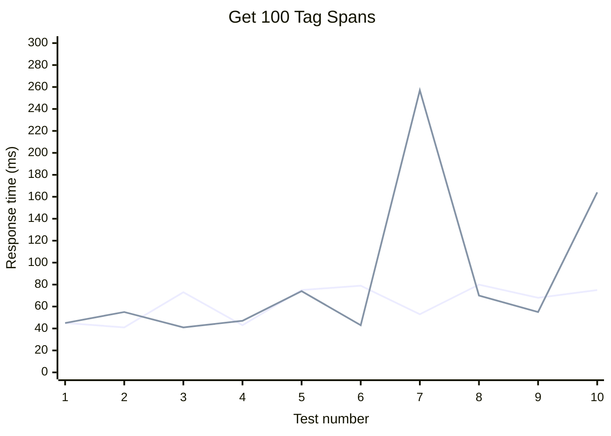
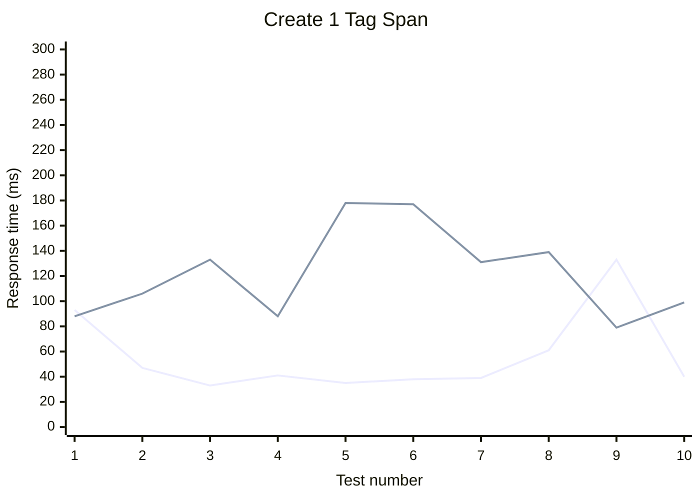
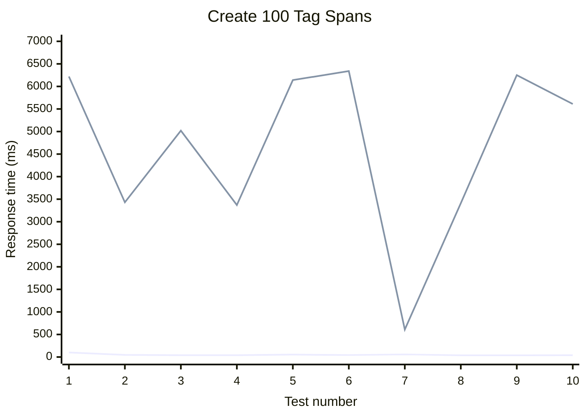
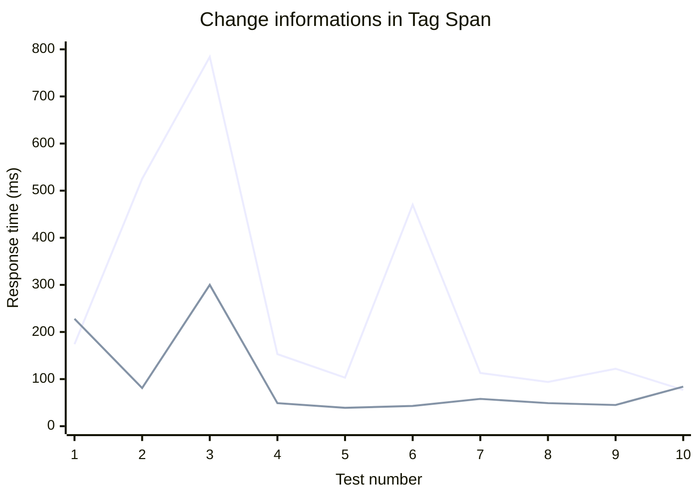

# Benchmarks for Tag Spans API

## Variants

- **embedded** - Table Chunks_test contains a field tagSpansArr, which is an array of spans that belong to the chunk
- **separate** - New table TagSpans_test contains spans that reference the chunk they belong to

## Tests

### Get Tag Spans for a single Chunk

- **blue** - embedded
-   - `GET /tag_spans/{{chunk_id}}?mode=embedded`
- **green** - separate
-   - `GET /tag_spans/{{chunk_id}}?mode=separate`

### Create Tag Spans

- **blue** - embedded
-   - `POST /tag_spans/, body: {mode: "embedded", spans: [number_of_spans]}`
- **green** - separate
-   - `POST /tag_spans/, body: {mode: "separate", spans: [number_of_spans]}`

### Update Tag Span

- **blue** - embedded
-   - `PATCH /tag_spans/update, body: {mode: "embedded", index: span_index, tagId: "new_tag_id"}`
- **green** - separate
-   - `PATCH /tag_spans/update, body: {mode: "separate", span_id: "span_id", tagId: "new_tag_id"}`

## Conclusion

- Getting Tag Spans for a single chunk is faster in the embedded variant - response times around 40-80 ms, separate variant around 40-250 ms.
- Creating Tag Spans is significantly faster in the embedded variant - response times around 30-60 ms for creating 1 span and around 40-60 ms for creating 100 spans, separate variant around 80-180 ms for creating 1 span and 600-6300 ms for creating 100 spans.
- Updating Tag Spans is faster in the separate variant - response times around 40-80 ms, separate version around 100-800 ms for the embedded variant.

Overall, the **embedded** variant performs better for **retrieving and creating Tag Spans**, while the **separate** variant performs better for **updating Tag Spans**.
